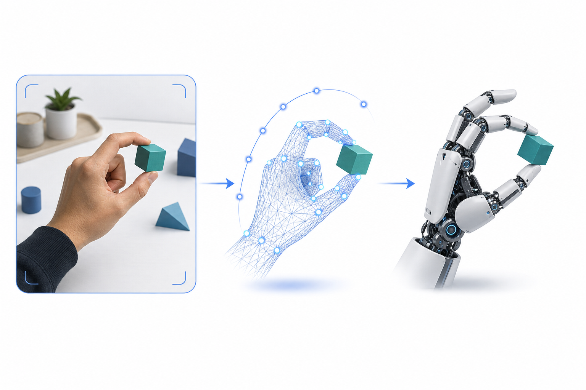

# human centric data for humanoid

> [English](readme-en.md) | 中文



用人类视频——而不是遥操作、动捕或专门的采集装置——来大规模生产机器人操作数据，正在成为一次范式级的转移。这篇文章从最上层的范式讲起，一层层收敛到一条具体可落地的技术线：灵巧手加显式 3D 重建；再把这条线放进 real、世界模型、仿真三种数据产线里做对比，借此看清这个方向正在发生的变化。

---

## §1 范式：为什么是 human → humanoid

机器人学习的根本瓶颈从来是**数据**。遥操作和动捕都很贵，采到的数据又绑死在单一本体、单一场景上，规模上不去。人类视频恰好相反：海量、多样、几乎零采集成本——YouTube、HowTo100M 这样的网络视频，加上 Ego4D、Ego-Exo4D 这类可穿戴第一人称数据集，量级和多样性都是采集数据比不了的。所谓范式转移，本质就是把"数据从机器人来"换成"数据从人来"。

问题在于人类视频不能直接拿来用。视频里有画面，却没有机器人能执行的动作标签；没有本体感觉（proprioception）；而且人手、人体的运动学跟机器人的运动学和控制接口根本不是一回事。一句话概括就是 human video ≠ robot action，这个领域所有的工作，本质上都是在有原则地跨过这道鸿沟。

想系统了解全貌，有两篇 2026 年的综述值得先读。一篇是 *From Human Videos to Robot Manipulation*（arXiv:2606.00054），站在 VLA 的视角，按"表征桥梁的类型"把方法分成 latent、world model、显式 2D、显式 3D 四座桥；另一篇是 *Robot Learning from Human Videos: A Survey*（arXiv:2604.27621），站在更通用的 LfHV 视角，按"信息流的层次"分成 task、observation、action 三层。两者是正交的两种切法，并不冲突——一个关心桥是什么表征，一个关心桥迁移的是哪一层信息。

真正把这些方法串起来的，是一个共同的本质：human video 唯一缺的就是 action 标签，所以跨过 human-to-humanoid gap 就等于想办法把缺失的 action 通道造出来。看似五花八门的四座桥，其实是造 action 监督的四种不同手段：

| 桥 | 怎么造出 action 监督 |
|---|---|
| 显式 3D | 直接恢复 3D 手轨(MANO)，即字面意义的 action 标签 |
| latent action | 自监督压出伪 action 潜码 |
| world model | 预测未来帧，action 是内部特征的副产物 |
| 显式 2D | 点轨迹 / 光流当弱 action 代理 |

（这张表只关心每座桥怎么补 action；每座桥的代表作、以及它在 scalable⟷grounded 谱系上的位置，留到 §2 讲。）

顺着这个视角，有一个常见的误解值得澄清：很多人以为 human video 只能喂给 world model 或视觉表征这些不需要动作标签的东西。其实不然，只要把 action 通道补出来，human video 完全可以直接用来预训练 VLA。VITRA 就是把 3D 手部轨迹当作动作标签，证明了"人类视频当 VLA 预训练数据"这条路走得通。world model 只是补 action 的四种方式之一，并不是唯一出口。

---

## §2 Landscape：三坐标轴与表征桥梁谱系

这个方向的工作看着杂，但几乎任何一份都能落到三根坐标轴上：

```
轴A 表征桥梁：  latent action ── world model ── 2D 线索 ── 3D 重建
               (可扩展/弱接地)                       (强接地/可执行)   ← HaWoR / Do-as-I-Do

轴B 目标本体：  floating 灵巧手 ── 固定基座双臂 ── 全身 humanoid (loco-manipulation)
                                                    ← EgoHumanoid / Human-as-Humanoid

轴C 数据来源：  互联网第三人称视频 ── 可穿戴 ego 采集 ── 生成式世界模型(合成)
                                                       ← Wh0
```

一份工作就是在这三根轴上各取一个点。比如 Do-as-I-Do 是"3D 重建 / 灵巧手 / 真实互联网视频"，Wh0 是"世界模型加 3D 标注 / 灵巧手 policy / 合成视频"，EgoHumanoid(2602.10106) 和 Human-as-Humanoid(2606.32009) 是"3D 全身 retarget / 全身 humanoid / ego(-exo) 采集"，LUCID(2606.11628) 则是"latent intent / embodiment-agnostic / 非结构化互联网视频"。

三根轴里，轴 A 表征桥梁是这个领域的主轴，也是本文的主线，值得单独展开。把 human video 到 robot action 的中间桥梁摊开，是一条从隐式、可扩展到显式、可执行的连续谱系：

| 桥梁 / 方向 | 代表工作（2026） |
|---|---|
| latent action（隐式动作） | Being-H0、VITRA、EgoVLA、LAPA/Genie 式 latent action |
| 预测式世界模型 | Wh0(2606.22136)、UniPi 式 |
| embodiment-agnostic intent | LUCID(2606.11628) |
| 显式 2D 线索 | Track2Act / ATM 系、point-flow 类 |
| 显式 3D 重建 | HaWoR、Do-as-I-Do(2606.19333)、VideoManip(2602.09013)、V2P-Manip(2606.16436)、DexMan(ICLR'26)、DexMit(2602.10105) |

谱系两端各有取舍。隐式一端跨视频源的可扩展性强，但接地弱；显式几何一端接地强、对机器人的可执行接口更清晰，代价是重建管线重。综述给出的核心判断是双轨并行，而不是谁取代谁：显式几何是近期更能落地的一轨，灵巧精度高、可执行接口清晰，是灵巧手当下的答案；而 latent action 与 latent world model 才是真正能吃下 web-scale 视频的一轨，它们自监督地从原始视频里压出伪动作，不需要 3D 标签，因此能吸收互联网规模的海量视频，而显式 3D 要逐帧重建，数据既贵又少，规模注定受限。概括起来，显式 3D 赢在精度和近期落地，latent 赢在规模和长期上限。

放到更长的时间尺度上，有三个趋势正在发生。其一是从手到全身：从桌面双手操作扩展到全身的 loco-manipulation，也就是真正意义上的 humanoid 化。其二是从真实到合成：生成式世界模型被寄望当作"无限数据发生器"来补真实视频的分布盲区，NVIDIA Cosmos+GR00T-Dreams、DreamGen、Wh0 都在这条线上，不过它目前更多还是方向性的投入而非成熟范式——生成视频的物理一致性尚未解决，3D 标签也仍要靠感知栈反推。其三是两条监督的解耦：把 intent 和表征（从视频里学、可扩展）与 control（在大规模并行仿真里学、可执行）分开，被不少人认为是最有前景的路线，LUCID 是代表。

---

## §3 收敛到 dexhand：为什么必须显式 3D 重建

灵巧手落在轴 A 最显式的那一端，这不是偏好，而是被任务目标逼出来的。平行夹爪只需要一个抓取点加开合，2D 线索或 latent action 就够用了；但灵巧手要控制每根手指的接触和力闭合，就必须拿到指尖级的 3D 手位姿、物体的 6-DoF 以及米制尺度，否则重定向出来的动作在物理上根本不可执行。

所以强调 3D 手部运动重建，对灵巧手方向是刚需，它提供的是唯一能喂给灵巧手重定向和 RL 的物理接地信号。换一个本体，比如夹爪，或者只学 high-level 的意图，就不必背这么重的 3D 重建。

需要说清楚的是，本文之所以收敛到显式 3D，是出于灵巧手的刚需和近期的可落地性，而不是因为它更 scalable。恰恰相反，前面已经说过，真正能吸收 web-scale 视频的是 latent 那一轨，显式 3D 的天花板正是逐帧重建、数据贵而少。更完整的图景是：短期用显式 3D 吃精度、抢落地，长期靠 latent 吃规模，两轨互补。

---

## §4 感知原语：HaWoR

§3 说的显式 3D 桥梁，落到实现就是一个感知原语——把视频变成米制尺度的 3D 手部运动。目前最成熟的一块是 HaWoR（CVPR'25，*World-Space Hand Motion Reconstruction from Egocentric Videos*），它能把任意第一人称或互联网人类视频，转成统一世界坐标系下连续、带米制尺度的 3D 手部运动轨迹。

它内部由几块拼成：手检测用 WiLoR 的 YOLO 检测器，给出每帧的手框、左右手、track id 和分割掩码；手姿态回归是 HaWoR 自己的 ViT 加时序 IAM 加 MANO，输出相机系下的手姿；相机轨迹用 masked DROID-SLAM，把动态的手 mask 掉、只用静态背景估相机位姿；米制尺度靠 Metric3D v2 的 ViT-Large 深度，去对齐 SLAM 那条 up-to-scale 的轨迹；出视野时则由一个 infiller 网络负责补全。

HaWoR 的意义在于它是个可复用的感知原语：下游不用再重新发明"怎么理解手"，直接在它的输出上做各自的事就行。不过下一节会看到，真正决定数据从哪来的，并不是这个原语本身，而是喂给它、或者绕开它的视频源。

---

## §5 三种数据发生器：real、WM、sim

有了感知原语，接下来真正的问题是从哪里源源不断地造出带 3D grounding 的训练数据。把"发生器"抽象出来，区别其实不在视频，而在那套 3D grounding 标签是怎么来的，一共三条产线：

```
raw real video   → 视频真实但无标签 → 用感知栈(HaWoR)"重建"出 label（反推，有噪声）
WM gen (Wh0)     → 视频合成但无标签 → 仍用感知栈(HaWoR)"重建"出 label（反推，有噪声）
sim engine gen   → 状态即 label     → 直接读引擎 ground-truth（零重建、零噪声）
```

第一条是 real，真实视频进，代表是 Do-as-I-Do（arXiv:2606.19333）。它是 reconstruction、retargeting、deployment 的三段流水线：reconstruction 阶段（SAM3 分割、SAM-3D 网格、MoGe 点图、HaWoR 手重建、GeoCalib 重力对齐、TAPIR、位姿跟踪）把日常人类视频里的手抠成 3D 运动；retargeting 阶段用 MuJoCo Warp 上的采样式 MPC 做物理优化，把人手轨迹重定向到机器人灵巧手；最后 deployment 上真机（UR3e 加 Sharpa 灵巧手）。在这条线里，HaWoR 扮演的是真实视频的手部感知前端。

第二条是 WM，生成视频进，代表是 Wh0（arXiv:2606.22136），流程是生成世界模型视频、感知标注、再喂给 VITRA 训练。数据来源换成了生成式世界模型——Qwen-Image-Edit 做场景编辑、Qwen3-VL 做提示增强、Wan 2.2 I2V 生成视频，当作一个无限视频源；但生成出来的视频仍要靠 HaWoR 打上 3D 手部运动标签，才能变成 VLA policy（VITRA 是 PaliGemma2-3B 加 DiT 动作头）的监督信号。这里 HaWoR 扮演的是合成视频的标注后端。视频来源从真实换成了合成，但中间那道 video 到 3D 手轨的工序没变。

第三条是 sim，思路完全不同：不从像素反推，而是让物理引擎直接给出状态。引擎里手的位姿、物体的 6-DoF、接触力、深度全都是已知真值，场景状态本身就是 3D 手轨真值，因此根本不需要 HaWoR 感知栈，连感知误差都没有。这就是三条产线的关键分水岭：real 和 WM 都要走感知反推、都依赖 §4 那条感知栈，而 sim 完全跳过了它。

把三源逐维度摊开对比：

| 维度 | 1. raw 真实视频 | 2. WM gen（Wh0） | 3. sim engine gen |
|---|---|---|---|
| 数据本质 | 互联网 / ego 真实录像 | 生成模型合成视频（Qwen-Edit→Wan I2V） | 物理引擎渲染（MuJoCo / Isaac） |
| 视觉真实度 | ★★★ 最真 | ★★☆ 照片级但有生成伪影 | ★☆☆ 有 sim look、渲染 gap |
| 分布 / 多样性 | ★★★ 天然长尾、海量 | ★★☆ 提示可扩展，受基模分布约束 | ★☆☆ 受资产库（物体 / 场景）限制 |
| 3D label 怎么来 | HaWoR 感知反推 | HaWoR 感知反推 | 引擎直接输出真值 ✅ |
| label 质量 / 自动化 | 差：遮挡、尺度歧义、噪声 | 中：同样反推，视角略可控 | ★★★ 完美真值、全自动、零成本 |
| 物理一致性 | ★★★ 本就真实物理 | ★☆☆ 不保证（生成未必物理可行） | ★★★ 引擎强制物理一致 |
| 可控性（要什么造什么） | ★☆☆ 只能捡现成的 | ★★☆ 提示 / 编辑可导 | ★★★ 任务 / 物体 / 相机 / 光照全可参数化 |
| 成本 / 可扩展 | 采集免费但清洗贵 | 中（推理算力） | 前期重（搭 scenario/资产/任务/物理调参），搭好后单任务边际成本极低 |
| 主要软肋 | label 噪声 + 版权 | 物理不可信 + label 仍要反推 | sim-to-real 视觉 gap + scenario/资产/任务搭建的重前期工程 |
| 代表工作 | Do-as-I-Do、EgoMimic | Wh0、DreamGen、Cosmos | DexMimicGen、MimicGen、RoboCasa、DexMan(sim)、DexGraspNet |

sim 这一列最容易被误读，值得单独说清楚。它的红利很实在，就是跳过感知栈、直出真值：real 和 WM 是"视频 → HaWoR(SLAM+MANO+深度) → 反推 3D 手轨（有误差）"，sim 则直接"场景状态 = 3D 手轨真值"，标签全自动、物理一致，连感知误差都没有。但它的代价远不止 sim-to-real gap，真正重的是前期 infra。要在引擎里搭出"打扫客厅""洗碗"这类按需场景，涉及资产、布局、任务和奖励设计、接触物理调参，本身就是重活；业界主流的用法（DexMimicGen、MimicGen、RoboCasa、Isaac Lab）其实是在已经搭好的场景里，把少量 demo 放大成大量数据，而不是凭空编写任意任务。归结起来 sim 有两处代价：一是视觉上的 sim-to-real gap，VLA 的视觉 encoder 很容易 overfit 到 sim 的观感；二是场景、资产、任务的搭建工程，它直接把多样性的上限卡死在资产库的规模上。

那到底该选哪条？三源不是平级的候选，目标不同，该押的源也不同。

```
        视觉真实度        物理 / label 真值        分布多样性
real  →    ★★★               ★(label反推)            ★★★
WM    →    ★★                ✗(物理不保证)           ★★
sim   →    ★                 ★★★(真值)               ★
```

如果目标是广覆盖的预训练语料，规模和多样性优先，那就以 raw video 打底。这正是 human-video 范式的立论所在：真实视频的长尾多样性是天然、免费、没有上限的，而"打扫客厅""洗碗"这种开放世界的长尾任务，恰恰是 sim 资产库最难覆盖、raw video 最擅长的；预训练本来就吃"量大带噪"胜过"量小干净"，反推带来的标签噪声可以接受。如果目标是少数几个要部署的技能，需要做闭环或 RL 精调，标签真值和物理优先，那就让 sim（或者干脆真机）定点上——这时精确的动作真值、接触物理、闭环 rollout 不可替代，但它属于窄目标的末端环节，不是数据引擎的主体；而且不该从零编写场景，而是用 sim 最擅长的两件事：已有少量 demo 时做 DexMimicGen 式的放大，以及末端任务的物理精调和评测。至于 WM，它的位置是定向补 raw video 的分布盲区，是补充而不是主力，别忘了它物理不可信、标签也仍要反推。

换个说法，sim 那套重前期 infra 加多样性天花板本身就否定了"拿 sim 当通用数据发生器"的想法：广覆盖交给 raw video，sim 退到需要物理真值的窄精度环节。这跟 §2 的双轨判断是自洽的——raw video 喂规模轨，sim 喂物理真值的窄环节。当然也存在自然的 hybrid：让 sim 出 grounded 的真值动作，再用 real 或生成视频补视觉真实度，比如把 sim 轨迹神经渲染成真实感视频，或者让 sim 与 real 联合训练。

---

## §6 延伸：显式 3D 状态作为物理基础世界模型的状态前端

前面三条产线，落点都停在"3D 手-物状态当作 label 或 demo"。但同一份 3D 状态还能撬动第三种用法，就是当世界模型的状态空间。

今天主流的 world model 是像素 WM，预测的是下一帧，Wh0 和 Cosmos 都是这一类，它的通病是会生成物理上不可能的未来，因为它只求"看起来对"。两篇综述都点名的头号未来方向，是物理基础世界模型：把 WM 的状态空间从"下一帧像素"换成"下一时刻的 3D 手-物状态"，DexWM 和 DWM 已经开了头，只是都还没上严格的物理约束。而"每帧 3D 手-物状态"恰恰就是显式 3D 产线的原生输出——real 和 WM 经 HaWoR 反推得到，sim 直接给真值，就 WM 状态质量而言，sim 的真值优于反推。

这个方向已经有了比 DexWM、DWM 更成熟的规模化实例：NVIDIA 与 Stanford 的 PointWorld（arXiv:2601.03782）。它把场景状态和机器人动作统一编码成 3D 点流，给定 RGB-D 观测和一段动作，就预测未来的逐点 3D 位移，实时（0.1 秒）推理并接进 MPC，做到从一张野外图像出发、零样本地完成推物体、开关节、工具使用等操作。它验证了"显式 3D 状态 + 世界模型 + 规划"这条路确实能 scale。不过要划清两条边界：一是它训练用的是机器人数据（DROID 遥操作加 BEHAVIOR 仿真），并不走人类视频这条桥；二是它的真机演示以单臂加夹爪为主、状态是全场景 dense 点流，而不是本文关心的灵巧手指尖级 3D 手-物状态。所以它是本文主线之外一条并行的路——同属显式 3D 世界模型，但数据源和末端都不同。

也就是说，显式 3D 产线不只能喂 VLA 的标签，也能直接当物理基础 WM 的状态源。不过这里得诚实一点：这条线并没有让"造 3D 状态"变便宜，它本质上仍是 §5 那套重管线——real 和 WM 靠 HaWoR 反推、有噪声且规模受限，sim 直出真值但有 sim-to-real gap。这正是"显式 3D 训 WM 看似显然却少人做"背后的老权衡：接地强和数据贵是一枚硬币的两面，HaWoR 并没有消掉它。真正的差异点也不在于解决了生产线，而在于谁手里已经有一条能用的 3D 状态生产线——有了它，就能从显式 3D 的 VLA 平移到物理基础 WM，而不必从纯像素 WM 从头起步。

---

## 小结

从全局到具体，这条线可以这样回顾：

| 层次 | 问题 | 落点 |
|---|---|---|
| 全局范式 | 为什么用 human video | 数据瓶颈 + human≠action 的 gap（§1） |
| Landscape | 怎么跨 gap / 有哪些方向 | 表征桥梁谱系 + 三坐标轴（§2） |
| 收敛 dexhand | 为什么强调 3D 手重建 | 灵巧手需指尖级物理接地信号（§3） |
| 感知原语 | 谁来做 video→3D 这道工序 | HaWoR（显式 3D 桥梁的实现，§4） |
| 数据发生器 | 造数据有几种产线 | real（Do-as-I-Do）/ WM（Wh0）/ sim 三源（§5） |
| 延伸 | 3D 状态还能当什么 | 物理基础世界模型的状态前端（§6） |

把这些串起来看，范式确实在从"手"扩到"全身"、从"真实视频"扩到"合成世界模型与仿真"；但对灵巧手这条线来说，把场景变成机器人可学的 3D 手部运动这一步始终是核心——真实和合成视频靠感知反推，仿真靠引擎直出。往前看，短期的确定性红利在显式 3D 已经成熟的落地上，可以拿来造 humanoid-ready 数据、微调小 VLA；中期的杠杆在 episode 化工具和 latent 预训练；长期则可以用 3D 状态的输出去支撑物理基础世界模型。一套显式 3D 数据产线，能同时喂 VLA、造合成数据、当 WM 的状态源。

---

## References

综述：

- *From Human Videos to Robot Manipulation: A Survey on Scalable VLA with Human-Centric Data* — [arXiv:2606.00054](https://arxiv.org/abs/2606.00054)（VLA 视角，按表征桥梁类型分 4 桥）
- *Robot Learning from Human Videos: A Survey* — [arXiv:2604.27621](https://arxiv.org/abs/2604.27621)（通用 LfHV 视角，按信息流层次分 3 层；配套列表 [IRMVLab/awesome-robot-learning-from-human-videos](https://github.com/IRMVLab/awesome-robot-learning-from-human-videos)）

主要引用工作：

- HaWoR — *World-Space Hand Motion Reconstruction from Egocentric Videos*（CVPR'25）
- Do-as-I-Do — [arXiv:2606.19333](https://arxiv.org/abs/2606.19333)
- Wh0 — [arXiv:2606.22136](https://arxiv.org/abs/2606.22136)
- VITRA — [arXiv:2510.21571](https://arxiv.org/abs/2510.21571) · [microsoft/VITRA](https://github.com/microsoft/VITRA)
- LUCID — [arXiv:2606.11628](https://arxiv.org/abs/2606.11628)
- DexWM — [arXiv:2512.13644](https://arxiv.org/abs/2512.13644) · [facebookresearch/dexwm](https://github.com/facebookresearch/dexwm)
- PointWorld — [arXiv:2601.03782](https://arxiv.org/abs/2601.03782) · [NVlabs/PointWorld](https://github.com/NVlabs/PointWorld)（3D 点流世界模型，机器人数据训练、非 human-video）
