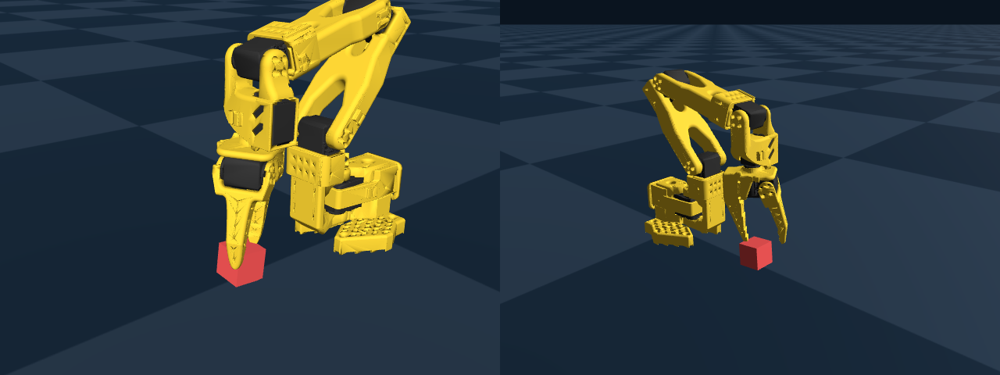
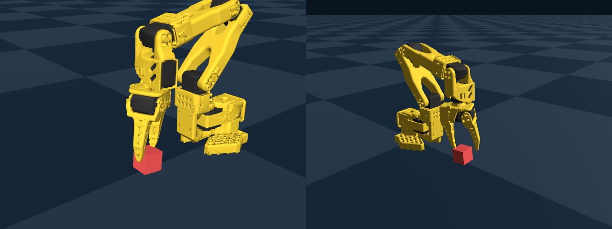
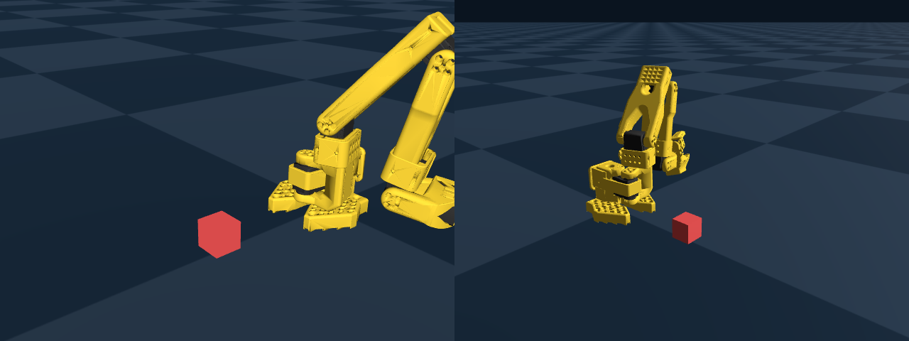
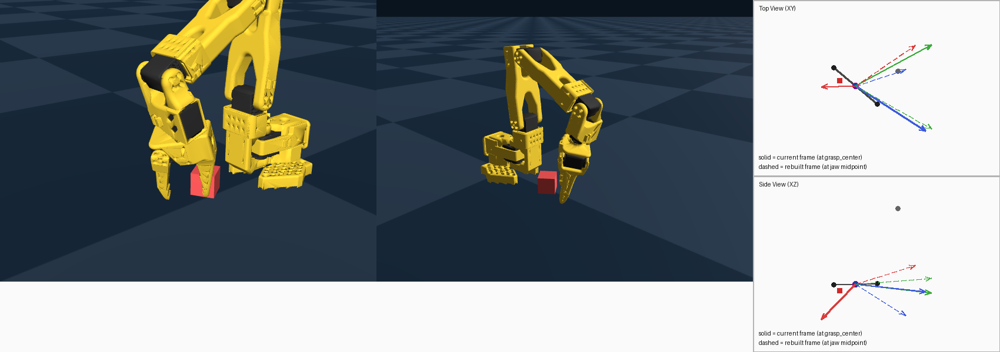
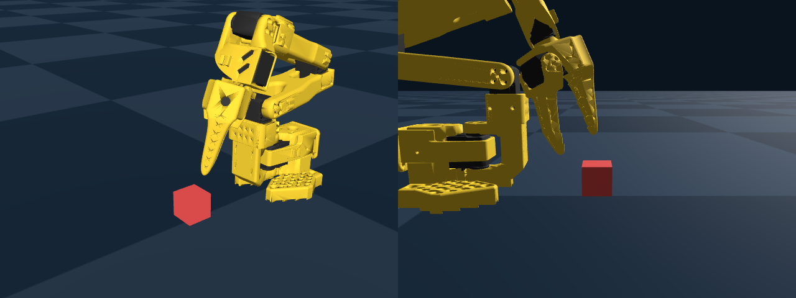
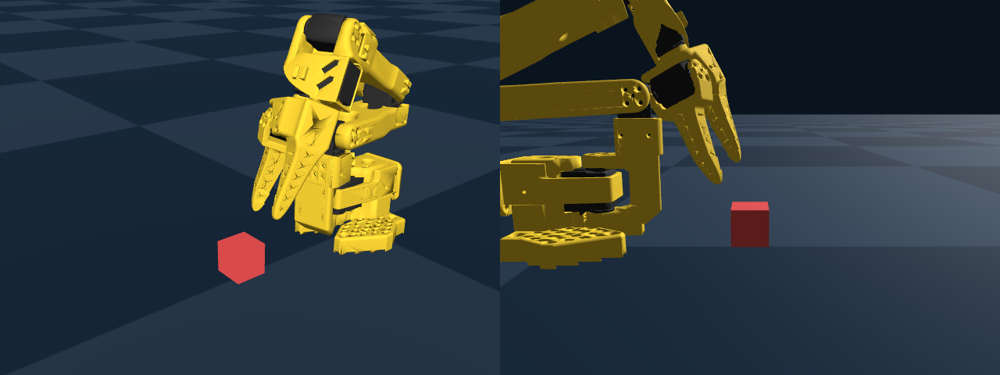
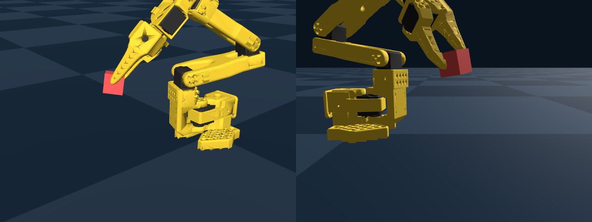

lerobot SO-101 × Genesis Sim in Practice -- A Week of Hitting Every 5-DOF IK Pitfall


## TL;DR

Spent a week trying to get SO-101 to grasp a cube in Genesis simulation. Core lesson: top-down grasping with a 5-DOF arm is a zero-redundancy problem. The official MJCF `grasp_center` has systematic bias — you must calibrate TCP and confirm the feasible workspace first, before trajectory planning. Tuning offsets should be the last thing you do, not the first.

## Background

The starting point was exploring non-Isaac Sim simulation alternatives in the community (btw, I'm a loyal Jensen Huang fan). I found two projects:
[Genesis]() and [ManiSkill3](). Genesis had nearly 30k GitHub stars, which felt like a solid entry point. For the robotics framework, I had no prior experience but had heard of [lerobot]() — after checking the repo, it turned out to be quite feature-rich. A great entry point as well.

The most basic robotic arm in lerobot is the [SO-101](), with 5/6 DOF — the minimum sufficient setup. I picked this one. Later I discovered that Genesis samples actually ship with the Franka arm. More on this pitfall later.


## Day 0

With GPT's help (hereafter "G"), I quickly got the lerobot and Genesis tutorial samples running and verified on a 4090. On one hand, I needed a quick overview of the lerobot/Genesis scope; on the other, I wanted to verify that G wouldn't be clueless about lerobot/Genesis (there were some Genesis version issues causing wrong API calls, but G fixed them quickly). The whole thing took less than 1 hour. Confidence soared — I figured at most a week to get the full pipeline working: sim data synthesis → training → validation with lerobot + Genesis.

## Day 1 ~ 6

The next day, the immediate idea was to put the SO-101 arm into the Genesis simulation environment and do a grasping experiment — arguably the simplest possible demo. Importing SO-101 requires a robot model file; the first one I found was the so101.mjcf on HuggingFace. I tossed it to G and asked for help building a cube-grasping scene in Genesis based on this model file. The script was done quickly, sent to the 4090 for testing — and that's when the problems started.


### 1. 1st Offset Tuning

The grasp failed. The basic symptoms: the jaws could only touch the cube's top surface — pressing, scraping, ultimately missing; or the arm would just flail around in the air. After a few rounds of discussion, G suggested adjusting offset-xy. Fine — my shallow understanding was that it simply wasn't aligned and needed parameter tuning. So I had G design an offset-xy sweep experiment with a fixed cube xyz position.

While G was crunching through experiments, I brushed up on the Genesis pipeline and robotics concepts:

__Genesis SO-101 Grasping Pipeline__

```
┌─────────────────────────────────────────────────────────────────┐
│              Genesis SO-101 Grasping Pipeline                    │
│                                                                   │
│  ┌─────────────┐    ┌─────────────┐    ┌─────────────────────┐   │
│  │ Scene Setup  │    │  Trajectory  │    │   Data Writing      │   │
│  │             │    │  Planning    │    │                     │   │
│  │ • SO-101    │───▶│ • IK Solve  │───▶│ • observation.state │   │
│  │   MJCF load │    │ • State     │    │ • action (degrees)  │   │
│  │ • Target    │    │   machine:  │    │ • images.top        │   │
│  │   object    │    │   Home      │    │ • images.wrist      │   │
│  │   domain    │    │   PreGrasp  │    │ • task (text)       │   │
│  │   random.   │    │   Approach  │    │                     │   │
│  │ • N parallel│    │   Grasp     │    │ LeRobotDataset      │   │
│  │   envs      │    │   Lift      │    │ .add_frame()        │   │
│  │             │    │   Place     │    │ .save_episode()     │   │
│  └─────────────┘    └─────────────┘    └─────────────────────┘   │
│                                                                   │
│  Output: HuggingFace Dataset (directly usable for lerobot training)│
└─────────────────────────────────────────────────────────────────┘
```


__SO-101 Joint Diagram__


```
                          SO-101  6-DOF Robotic Arm Joint Diagram
                              (Side View · Home Pose)

          [1] shoulder_lift                    Motion Type   Range (approx.)
               ◉─────────────── Upper Arm ─┐   ↕ Pitch     -90° ~ +90°
              ╱                             │
             ╱ [0] shoulder_pan             │
      ↺ Horizontal rotation           [2] elbow_flex
            │                               ◉   ↕ Pitch     -120° ~ +120°
       ┌────┴────┐                          │
       │ ▓▓▓▓▓▓ │                           │
       │  Base   │                  Forearm  │
       │ ▓▓▓▓▓▓ │                           │
       └────────┘                      [3] wrist_flex
      ▀▀▀▀▀▀▀▀▀▀▀▀                         ◉   ↕ Pitch     -90° ~ +90°
      ═══ Table ═══                         │
                                       [4] wrist_roll
                                            ◉   ↻ Roll      -180° ~ +180°
                                            │
                                       [5] gripper
                                          ┌─◉─┐
                                          │   │  ↔ Open/Close 0° ~ 70°
                                          ╘═══╛
```


__Gripper Concepts__

```
SO-101 Gripper Structure (Side View, Closed State)

     ┌──────────────┐
     │  gripper body │  ← "gripper" link = wrist/gripper base
     │  (body origin)│     Its coordinate origin is here, NOT at the fingertips
     └──────┬───────┘
            │
    ┌───────┴────────┐
    │                │
    ▼                ▼
 ┌─────┐        ┌─────┐
 │fixed│        │moving│  ← moving_jaw_so101_v1 (active jaw)
 │ jaw │  ████  │ jaw  │
 │     │  ████  │     │     ████ = grasped cube
 └──┬──┘        └──┬──┘
    │              │
    └──────◉───────┘
           ↑
      jaw pinch center
      = center contact point when both fingertips close
```


__Tuning Concepts__


**approach_z**

`approach_z` is the z-offset of the **grasp reference point** relative to the cube center. This "grasp reference point (grasp_center)" must be defined correctly before discussing whether `approach_z` is appropriate.


```
        approach_z = 0.02 (default)      approach_z = 0.0 (lower, near graspable)

     z(m)                                     z(m)
     0.05 ┤                                   0.05 ┤
          │                                        │
     0.04 ┤                                   0.04 ┤
          │    ┌───┐ ← IK target                   │
     0.035┤    │ ◉ │   (gripper frame)             │
          │    │   │                          0.03 ┤ ┌─────┐ ← cube top
     0.03 ┤ ┌──┤   ├─┐ ← cube top                  │ │     │
          │ │  └───┘ │                             │ │     │
     0.015┤ │ ██████ │ ← cube center          0.015┤ │██◉██│ ← IK target = cube center
          │ │ ██████ │                             │ │█████│   fingertips wrap around sides
     0.00 ┤ └────────┘ ── table               0.00 ┤ └─────┘ ── table
          └──────────────────                      └──────────────────

    Problem: fingertips above cube top              Correct: fingertips wrap cube sides
    Gripper "air grabs" → cube doesn't move         Gripper generates contact force → can lift
```


**offset_xy**

There may be systematic bias between the IK-solved gripper position and the cube center. `offset` is an **additional spatial fine-tuning** applied during approach/close/lift phases.

```
            Top View (looking down)
      y
      ↑
      │    Each · is a candidate (ox, oy) pair
      │
 +0.01│  ·    ·    ·    ·    ·
      │
+0.005│  ·    ·    ·    ·    ·
      │
  0.0 │  ·    ·    ◆    ·    ·     ◆ = cube center (IK default target)
      │                ↑
-0.005│  ·    ·    ·   ★ ·    ·     ★ = best offset found
      │
 -0.01│  ·    ·    ·    ·    ·
      └──────────────────────→ x
        -0.01      0.0     +0.01
```


**offset_z**

```
     oz > 0 (too high)       oz = 0 (default)         oz < 0 (lower)
        ┌─┐                    ┌─┐                    ┌─┐
        │ │ ← fingertip       │ │                    │ │
        └─┘                    └─┘                    └─┘
                            ┌──────┐               ┌──────┐
      ┌──────┐              │██████│               │██│ │██│
      │██████│              │██████│               │██└─┘██│ ← fingertips on cube side
      └──────┘              └──────┘               └──────┘

     No contact              Occasional scrape       Has contact, might grasp
     Δz ≈ 0                 Δz ≈ 0.005              Δz ≈ 0.01+
```

With the concepts refreshed, G's experiments were also done. However, the result was: **adjusting offset-xy alone, the cube never ended up between the two jaws during the approach phase — grasping failed consistently**. During this process, I also found a definitional error from G: G initially assumed `-20` means tighter grip than `0`, but in reality **gripper_close** — the larger the value, the wider the opening.


| Concept | Full Name | Description |
|---------|-----------|-------------|
| **EE** | End Effector | The end effector; for SO-101, it's the entire gripper mechanism |
| **TCP** | Tool Center Point | A reference point on the EE, the IK target. In this project = `grasp_center` body |
| **gripper** | — | A link in MJCF, corresponding to the wrist/gripper base. Note: its body origin is at the base, not at the fingertips |
| **fixed jaw** | — | The stationary jaw (one side), part of the gripper body geometry |
| **moving jaw** | — | The active jaw (driven by the `gripper` joint) |
| **jaw pinch center** | — | The center contact point between fixed jaw and moving jaw when closed. **This is where the object is actually grasped** |
| **grasp_center** | — | A manually added fixed body in MJCF, attached under the gripper body. Designed as TCP so IK can solve directly to the pinch center |
| **gripperframe** | — | An official MJCF site; `grasp_center` body copies its pos/quat |
| **body origin** | Link coordinate origin | The coordinate origin of each link body. Note: body origin ≠ the visual farthest point of the mesh (fingertip) |


### 2. 1st grasp_center Calibration

I had G analyze the failure cases frame by frame. The clear common pattern: **the jaws could touch the cube, but always just barely scraping the outer edge — the cube was never between the two jaws**. G's conclusion: **there's a TCP geometric alignment issue**, which is why purely adjusting offset-xy had no effect. Two sub-problems emerged:

1. Whether the TCP reference point has systematic bias.
2. Whether the IK solver can accurately solve joint poses to reach the IK target.

__Systematic Bias Calibration__

A side note: SO-101 model files in different formats have significant differences. This is a real-world issue with the SO-101 demo arm: different assemblies introduce systematic bias during construction, so there's no universal model file. You can't just use any real-machine model file directly in a simulation environment. Comparison:

| Metric | URDF | MJCF | Improvement |
|--------|------|------|-------------|
| Model source | HuggingFace URDF + 13 STL manual download | Genesis-Intelligence/assets auto-download | Simpler |
| Home tracking error | 8.27° | **0.12°** | **69× improvement** |
| DOF count | 6 (requires `fixed=True`) | 6 (MJCF naturally fixes base) | No extra params needed |
| EE link | `Fixed_Jaw` / `gripper` | `gripper` | Consistent |
| Loading complexity | URDF download + STL + `fixed=True` + base_offset | MJCF single file + auto-download | Greatly simplified |
| State range | [-147.6°, 100.0°] | [-154.3°, 121.5°] | Larger IK coverage |

Next, I switched the SO-101 model file to the Genesis-provided MJCF format, then calibrated grasp_center based on the MJCF file. I had G write a calibration script:

1. Read current `grasp_center.pos` / `grasp_center.quat` from the XML
2. Fix cube pose at `[0.16, 0.0, 0.015]`, do deterministic XY offset coarse + refine search
3. Rank using `approach_tcp_error`, `approach_z_abs_error`, `approach_xy_error`, `local_xy_center_error` metrics
4. Output:
   - Best runtime offset (world)
   - `suggested_grasp_center_delta_local`
   - `suggested_grasp_center_pos_local`
5. Write the recommended grasp_center back to XML

| Version | `grasp_center.pos` local | Scoring logic | Main observation | Conclusion |
|---------|--------------------------|---------------|------------------|------------|
| `default` | `[-0.0079, -0.000218, -0.0981]` | Official default, no correction | XY often lands on cube edge, easy to miss during close | Reachable, but TCP not aligned with true pinch center |
| `v1` | `[-0.0297, -0.0039, -0.0957]` | Prioritize `lift_delta` / `close_contact_delta` | Clear over-shoot; shifted from one side to the other | Old scoring misidentified "pushing" as a good result |
| `v2` | `[+0.0004, +0.0069, -0.1023]` | Prioritize first-frame `local_xy_center_error` at close | XY projection more centered, but IK sanity degraded to ~7.9mm, lift=0 | Good geometric score but IK reachability degraded, worse in practice |
| `v3` | `[+0.0093, -0.0065, -0.0942]` | Constrain approach reachability first, then consider close centering | IK sanity recovered to 0.2mm; lift_delta=+0.004m; still pushes away during close | Currently most usable; next priority is tuning grasp flow parameters |

This initial calibration experiment yielded one clear conclusion: **the official model file's predefined grasp_center has systematic bias**. All subsequent experiments would build on this updated grasp_center. Note that `grasp_center` is just a predefined link in the MJCF with fixed pos/quat relative to the gripper body origin (parent link).

__IK Solver Accuracy Experiment__

Can the IK solver actually deliver joints to the specified position? Using different reference points, experiments showed:

| Link | World z (body origin) | Diff from cube center_z |
|------|----------------------|------------------------|
| grasp_center (predefined TCP proxy) | 0.015 | 0 (IK precision 0.0002m) |
| gripper (body origin) | 0.104 | +0.089 |
| moving_jaw (body origin) | 0.090 | +0.075 |

This experiment confirmed: **with grasp_center as the IK target, the IK solver achieves very accurate solutions.**

Returning to the original problem — jaws always hovering at the cube edge — it was now clear: **the previously defined grasp_center didn't match the true grasp center (cube center)**.


### 3. 2nd Offset Tuning

With the updated calibration parameter v3, it was worth having G re-run the experiments. Unfortunately, during the approach phase, the jaw landing XY was still biased to one side of the cube — the cube still wasn't centered between the jaws. I assumed the grasp_center calibration was now correct, and the remaining bias just needed offset-xy adjustment.

Based on the first offset tuning experience, in world coordinates:

- `oy` primarily controls lateral translation of the jaw corridor within the cube's top-surface plane
- `ox` primarily controls the gripper's front-to-back approach depth relative to the cube

G ran several experiment groups:

__Fixed ox, sweeping oy__

- `ox = +0.004`
- `oy in {-0.004, -0.002, 0.000, +0.002, +0.004}`

**ox0004_oyp0004**



**ox0004_oym0004**



Key observations:

- After `oy` changed from `+0.004 → -0.004`, the jaw corridor in the left view clearly shifted laterally as a whole
- This indicates `oy`'s primary effect is overall translation, not changing the relative position of a single jaw
- But in the right view, the inner jaw still contacts the box's inner side first, so the problem isn't just `oy`


__Fixed oy, sweeping ox__

- `oy = +0.004`
- `ox in {+0.004, +0.002, 0.000, -0.002}`

**ox0000_oyp0004**


Key observations:

- After `ox` changed from `+0.004 → 0.000`, the inner jaw "pushing inward" in the right view weakened
- This indicates `ox`'s primary effect is more like front-to-back depth, not lateral centering
- Meanwhile, the box in the left view still roughly stays near the jaw corridor, not immediately pushed out


__Anchor Re-test__

Extracting positive trends from the two sweep rounds, a new anchor was set:

- `ox = 0.000`
- `oy = -0.004`

Key observations:

- Compared to `ox0004_oyp0004`, in this group the box mostly stayed between the two jaws during `approach → close`
- But the `approach` phase still showed noticeable tipping, indicating the current baseline can't directly proceed to `close` tuning
- Therefore, the problem has progressed from "can't enter jaw corridor at all" to "can enter corridor, but approach still isn't quasi-static enough"

**ox0000_oym0004**


#### Summary and Reflection

The above offset tuning experiments broadly established how `ox / oy` affect the relative position between jaws and the cube's top surface. But the significant issue was: during the `approach` phase, the cube was already being tipped by jaw contact/scraping, causing the box's top surface to no longer be parallel to the table. This is already counter-intuitive. For such a simple cube grasping task, the gripper should come straight down, grip the cube, and lift — even with slight contact, there shouldn't be significant tipping, translation, or penetration.

A more important signal: **offset_x/y is just a compensation tool and should not be the primary tuning path for grasping**

~~End of Day 3~~


### 4. Solver Parameter Experiments

Further experiments with solver parameters:

1. `episode_length=[8, 12, 16]` — same phenomenon: cube knocked over by the jaws. Indicates **approach step granularity is not the main cause**
2. IK quat_down constraint directly caused IK solving failures. The key insight: **a 5-DOF mechanism cannot simultaneously satisfy grasp_center's position constraint and a top-down orientation constraint**




### 5. 2nd grasp_center Calibration

With the newly calibrated grasp_center, adjusting position (xyz) still didn't solve the problem. G suspected: **it's not just a slight pos offset — the axis directions of the grasp_center frame itself are wrong**. I.e., there's quaternion bias; purely adjusting offset-xyz obviously won't fix it.

__Axis Error Verification__

G designed a quick verification experiment: compare the v3-calibrated grasp_center's quat (3 axis directions) with a geometrically reconstructed grasp_center quat based on the jaw corridor, closing direction, and approach direction as xyz axes. Then compare in world coordinates whether v3's predefined grasp_center.quat matches the jaw geometry-reconstructed grasp_center.quat. Two offset parameter sets from the 2nd offset tuning were used:

* Verification group 1: oxyz=[0.008, 0.000, -0.010]
* Verification group 2: oxyz=[0.000, -0.004, -0.010]

| Item | Current v3 `grasp_center` local | Geometry-rebuilt quat (v4) | Comparison |
|------|--------------------------------|---------------------------|------------|
| `pos` | `[0.009342, -0.006544, -0.094165]` | `[0.013867, 0.002400, -0.082094]` | `delta ≈ [+0.004525, +0.008944, +0.012071]` |
| `quat` | `[0.707107, 0.0, 0.707107, 0.0]` | `[0.144190, -0.598573, -0.684636, -0.390119]` | Current frame axis semantics clearly inconsistent with jaw geometry target frame |
| Axis semantic error (deg) | - | `x≈131.64, y≈91.20, z≈74.36` | Results consistent across both offset conditions (stable conclusion) |

Expanding the derivation proves that `residual_local = jaw_mid_local(gripper_angle) - gc_local_pos`, where `gripper_world_rot` cancels out entirely. That is, **`residual_local_delta` depends only on `gripper_angle` and `gc_local_pos`, and is independent of arm configuration (shoulder/elbow/wrist joint angles)**. Both groups used the same v3 XML and the same `gripper_open=20`, so the residuals are identical.

More intuitively, I had G visualize the axis direction differences:


**Solid arrows** (red/green/blue) represent the v3 local `grasp_center` frame's x/y/z axes, with origin at the blue dot; **dashed arrows** (red/green/blue) are the x/y/z axes geometrically reconstructed from the jaw corridor, with origin at the magenta dot.

The figure conveys two key pieces of information:

1. **Position residual**: The gap between the blue dot (current grasp_center) and magenta dot (jaw midpoint) ≈ `residual_world_delta`. In the Top View, the blue dot is to the left and below the magenta dot; in the Side View, the blue dot is to the lower-left, showing that the current `grasp_center` has bias in both XY and Z relative to the true pinch center.

2. **Axis direction mismatch**: The solid arrows (current frame) and dashed arrows (rebuilt frame) don't overlap at all. In the Top View, the most obvious is the red arrow (x-axis): solid red points left, dashed red points upper-right — essentially opposite (corresponding to `x ≈ 131.64 deg`). The green arrows (y-axis) are also nearly orthogonal (corresponding to `y ≈ 91.20 deg`).

**The key question: does this axis error actually affect the current grasping pipeline (IK solving)?**

1. All current IK solver calls use `quat=None` (position-only IK), so `grasp_center.quat` doesn't participate in IK solving and doesn't change the arm configuration
2. The pos_delta can be directly updated. `suggested_local_pos≈[0.0139, 0.0024, -0.0821]` replaces the v3-calibrated grasp_center pos: `[0.0093, -0.0065, -0.0942]`.

This completed the v4 re-calibration. Compared to v3, all three components are positive corrections, with a total displacement of ≈ 12mm.

__v4 Calibration Verification__

Using the same two offset groups to verify the v4 calibration residuals:

```
Residual world delta:      [0.0, -0.0, -0.0]
Residual local delta:      [0.0, 0.0, 0.0]
Suggested local pos:       [0.013867, 0.0024, -0.082094]  (= v4 pos, no further correction)
```



Conclusion: v4 pos is geometrically correct (residual=0), IK reachable (`quat=None` sanity err=0.2mm)

~~End of Day 4~~

### 6. 3rd Offset-XY Tuning

__v4 Tuning__

With v4 calibration parameters in hand, the remaining problem should just be minor offset adjustments, right? G never complains — another sweep of offset-xy. This time starting directly from the 2nd tuning's best seeds, with extra focus on the jaw geometry-rebuilt axis deviation.

| Exp | offset(ox, oy, oz) | closing_axis_offset | approach_axis_offset | centering_error | jaw_balance_error | Conclusion |
|-----|-------------------|---:|---:|---:|---:|------------|
| Exp1 | (0.004, -0.004, -0.01) | +0.0287m | +0.0264m | 0.0413m | 0.0665m | Large deviation with tilt |
| Exp2 | (0.002, -0.004, -0.01) | +0.0275m | +0.0269m | 0.0410m | 0.0644m | Contact/tilt improved but geometric deviation still large |
| Exp3 | (0.000, 0.000, -0.01) | -0.0199m | +0.0143m | 0.0332m | 0.0290m | Direction changed but deviation still significant |

Several notable observations:

* `closing_axis_offset` represents the projection of (cube_center - jaw_midpoint) onto the closing axis. It flips sign across different `ox/oy` values (e.g., from about `+0.02m` to `-0.02m`), indicating XY offset just toggles between left and right sides.
* `approach_axis_offset` represents the projection of `(cube_center - jaw_midpoint)` onto the approach axis. It remains mostly positive and at centimeter scale, indicating systematic bias along the approach direction persists.
* `centering_error`, `||cube_center_world - jaw_midpoint_world||`, represents the 3D distance between cube center and jaw midpoint (smaller is better). Neither it nor `jaw_balance_error` was driven to small magnitudes by the offset sweep (still at centimeter scale).

__tcp_offset with cube__

Still no luck — v4 calibration didn't solve the grasping problem either. G suggested: check **tcp_offset = tcp_actual - ik_target** to see if there's systematic bias between the actual TCP and the IK target. Based on the 3 experiments above:

| Exp ref | offset(ox, oy, oz) | ik_target (x,y,z) | tcp_actual (x,y,z) | tcp_offset (x,y,z) | gripper_jaw_z | cube_top_z | jaw_below_top |
|---------|-------------------|-------------------|-------------------|-------------------|---:|---:|---|
| Exp3 | (0.000, 0.000, -0.010) | (0.1600, -0.0000, 0.0167) | (0.1644, -0.0001, 0.0229) | (+0.0044, -0.0001, +0.0062) | 0.0649 | 0.0289 | False |
| Exp2 | (0.000, -0.004, -0.010) | (0.1600, -0.0040, 0.0167) | (0.1644, -0.0043, 0.0229) | (+0.0044, -0.0003, +0.0061) | 0.0650 | 0.0291 | False |
| Exp1 | (0.004, 0.000, -0.010) | (0.1640, -0.0000, 0.0167) | (0.1688, -0.0002, 0.0235) | (+0.0048, -0.0002, +0.0068) | 0.0641 | 0.0296 | False |

All 3 experiments showed a consistent `tcp_offset ≈ [0.004, -0.0002, 0.006]`, but this couldn't be conclusively attributed to systematic bias — it was more likely caused by jaw-cube contact producing a displacement.

__tcp_offset without contact__

G ran a contact-free (no cube) experiment to observe the tcp_offset systematic bias.

Before continuing, we first established that grasp_center must exactly be the `inner pinch surface midpoint`, not the link origin. In Genesis, `link.get_pos()` returns the link frame origin's world coordinate, not the contact point/fingertip. Ref: [rigid_link.py](). Implementation: read fixed_jaw_box / moving_jaw_box from XML, compute each one's inner surface world point, then calculate jaw_midpoint.

- Using `link origin` as reference: "~6cm offset", but doesn't represent the true pinch contact center.
- Using `fixed_jaw_box/moving_jaw_box` inner contact surface midpoints, `grasp_center` and jaw midpoint basically coincide during approach.

Then, fixing Exp1 parameters with no cube, measuring tcp_offset and delta_jaw:

```yml
tcp_offset_global_mean = [ +0.00050, -0.00001, +0.00049 ] m
tcp_offset_global_std_over_points = [ 0.00126, 0.00003, 0.00118 ] m
delta_jaw_global_mean = -0.02241 m
delta_jaw_global_std_over_points = 0.00259 m
```

Key conclusions:

1. Without contact, most points have `tcp_offset` near 0 (sub-millimeter to millimeter scale), using jaws-midpoint as grasp_center.
2. Without contact, `delta_jaw` is not 0 (mean ≈ -22mm), indicating the "jaw relative height difference" exists even without contact — it can't be explained by contact alone; its source is likely `quat=None` orientation freedom + link origin definition.
3. Comparing with the with-cube results, the previously large deviations were more like contact perturbation + local IK/pose residual amplification, rather than systematic tcp_offset bias.

At this point, I was getting frustrated. Such a naive, toy-level experiment — why couldn't it succeed?


### 7. delta_z Leveling

Experiment 6 revealed that even without cube grasping, the two jaws have a default height difference (delta_jaw) in the current configuration — **which is strange**. Both jaws exhibited some roll angle, causing one jaw to always touch the cube's top surface first during approach. The solution was to level the jaws' delta_z first, trying to balance the jaw heights before descending to grasp.

Experiment goal: converge `delta_z = z_moving - z_fixed` to within threshold (`|delta_z| <= 0.004m`), then proceed to stable grasping.

G completed the experiment, and the `delta-z constraint` before/after change was clearly visible:

Before:



After:



The `delta-z constraint` worked in isolation, **but** after introducing the delta-z constraint, the IK solver diverged when continuing to solve based on the init-plan's waypoints — it couldn't return to the approach-hold trajectory. During approach, the jaws were leveled, but the entire trajectory broke, ultimately unable to reach the cube.

### 8. IK Reachability Issue

Experiment goal: starting from "current pose + delta-z leveled pose", do **pure replanning**.

```py
  // ... after leveling succeeded
  for ri in range(N_REPLAN_WPS):          # 4 steps
      alpha = (ri + 1) / N_REPLAN_WPS     # 0.25, 0.50, 0.75, 1.00
      desired_mid = mid_leveled + alpha * (pre_close_target - mid_leveled)
      rp_wp = solve_ik_seeded(
          desired_mid,                     # desired midpoint world coordinate
          args.gripper_open,
          replan_prev_rad,                 # previous step's joint angles as seed
          quat_target=quat_ref,            # ← fixed orientation constraint!
          local_point=mid_local_pt,
      )
      replan_wps.append(rp_wp)
      replan_prev_rad = np.deg2rad(np.array(rp_wp, dtype=np.float32))
```

Here the IK solver needs to simultaneously satisfy two constraints:
  * Position: send midpoint to desired_mid
  * Orientation: make the grasp_center link's orientation equal to quat_ref (locked after leveling)

SO-101 has only 5 effective DOF (gripper open/close is the 6th). 5 DOF to simultaneously satisfy 3 position constraints + 3 orientation constraints = 6 constraints — not enough DOF. The IK solver, using damped least squares with damping=0.02, compromises by sacrificing position to preserve orientation. The midpoint gets stuck, unable to advance toward the cube. A classic case of **full pose constraint being mathematically over-constrained**.


__rot_mask Relaxed Constraint__

By introducing `rot_mask`, the over-constrained problem was resolved, and IK could continue descending:

```py
    rp_wp = solve_ik_seeded(
        desired_mid,
        args.gripper_open,
        replan_prev_rad,
        quat_target=quat_ref,
        local_point=mid_local_pt,
        rot_mask=[False, False, True],
    )
```

At this point:

* desired_mid = [0.160, 0.000, 0.017] (directly above cube center)
* mid_actual = [0.157, 0.004, 0.035]
* X direction difference ~3mm (very small), but Z direction difference 18mm (0.035 vs 0.017). XY is basically aligned, but height is still 1.8cm too high.

**Under rot_mask=[F,F,T] constraint, IK can only get the midpoint to Z=0.035, still ~1.8cm short of the target height. Still a reachability problem.**

An intuitive idea was to make the cube taller. Obviously ugly. With cube_height=0.08, although IK reachability improved, the jaws collided with the cube first, knocking it over — still couldn't grasp.

Intuitively, **using delta_z leveling + replan for a simple grasping experiment is already far too complex. Something must be fundamentally wrong.**

~~End of Day 5~~


### 9. Feasibility Space Experiment

__5-DOF Kinematic Hard Constraints__

SO-101 has 5 effective DOF (shoulder_pan, shoulder_lift, elbow_flex, wrist_flex, wrist_roll); the 6th is gripper open/close. In a top-down pinch grasp task, the following constraints must be simultaneously satisfied:

| Constraint | DOF Required | Description |
|-----------|-------------|-------------|
| XYZ Position | 3 | Send jaw midpoint to cube center |
| Approach direction (pitch) | 1 | Gripper facing down |
| Jaw plane alignment (yaw) | 1 | Jaw plane parallel to cube side |
| Total | 5 | Exactly uses all available DOF |


This means **zero redundancy** — IK has a unique solution.

Every tuning attempt in the previous experiments (offset_xy, approach_z, quat_mode, roll_tuning, rot_mask, cube_height) was perturbing a zero-redundancy system. No redundancy means:

  * Change offset → IK solution jumps to a completely different configuration
  * Change cube height → reachable region boundary changes entirely
  * Add orientation constraint → immediately becomes over-constrained

**This isn't "haven't found the right parameters" — the structure of the search space itself doesn't support stable solutions.**

This insight fundamentally changed the approach: instead of continuing blind offset tuning, we should first compute SO-101's **feasible grasp region**. I had G write a feasibility scanning script with the core logic: iterate over a discrete grid of `(cube_x, cube_y, approach_z, gripper_open)`, run position-only IK for each parameter set, filter by `pos_err < 1mm`, `|delta_z| < 4mm`, `jaw_gap > cube_size`, and output all feasible parameter combinations.

The result: **the cube position `[0.16, 0.0, 0.015]` we had been using all along was right on the boundary or even outside the feasible region**. This explained why all previous tuning felt like dancing on a knife's edge — the initial conditions themselves weren't within the stable feasible region. The feasibility script recommended a new set of default parameters:

```yml
cube_x=0.15, cube_y=-0.06, cube_size=0.03
grasp_offset_z=0
approach_z=0.012
gripper_open=25
→ pre_close_target_z = 0.015 + 0 + 0.012 = 0.027 (optimal z layer)
```

This point had pos_err=0.27mm, delta_z=-1.46mm, jaw_gap=33.7mm > 30mm — **fully feasible**. The key change was `cube_y` moving from `0.0` to `-0.06`, placing the cube closer to the shoulder_pan rotation axis's natural downswing direction, resulting in a more natural IK configuration and greatly reduced jaw roll tilt.

Looking back, G's initial value of `cube_y=0.0` had placed the cube right on the feasible region boundary — this was the root cause of all previous experiment failures. Let's try the new parameters:


It actually grasped! Though the cube eventually slipped through — likely a gripper angle issue and collision parameter settings. G then ran several more experiments:

1. substeps 4 → 8: no difference
2. use_jck collision algorithm: no difference
3. jaw-box thickness (0.002 → 0.004): no difference
4. Adjusting gripper_close angle:

| close | cube_shift_z (m) | cube_shift_norm (m) | cube_tilt_deg | Result |
|------:|---:|---:|---:|--------|
| 16 | 0.09516 | 0.09623 | 13.81 | Stable lift |
| 18 | 0.09431 | 0.09555 | 10.73 | Stable lift |
| 20 | 0.09389 | 0.09504 | 9.49 | Stable lift |



~~End of Day 6~~

## Conclusion

With G's (GPT's) tireless support, after a week of back-and-forth, I finally managed to successfully grasp a cube in the Genesis simulation environment. Looking back at the entire process, the pitfalls can essentially be distilled into one sentence: **in a zero-redundancy 5-DOF system, the right approach is to first confirm the feasible region, not to tune parameters.**

Core lessons:

1. **Compute the feasible region first, then attempt grasping.** Top-down grasping with a 5-DOF arm is a zero-redundancy problem — the cube placement must be within the IK feasible region. For initial conditions outside the feasible region, no amount of offset / approach_z / orientation constraint tuning will converge.
2. **TCP (grasp_center) calibration is a prerequisite.** The official MJCF's `grasp_center` has ~12mm systematic bias relative to the true jaw midpoint. Running grasping experiments without calibration means all subsequent computations are based on wrong coordinates.
3. **Offset is a compensation tool, not the primary tuning path.** If you need large offset adjustments to achieve a grasp, something upstream (TCP calibration or cube position) is almost certainly wrong.
4. **Be very cautious adding orientation constraints to ≤6 DOF arms.** 5 DOF satisfying 3 position + 3 orientation = over-constrained. The IK solver will sacrifice position accuracy as a compromise. Partial relaxation via `rot_mask` is a necessary technique.

**The recommended workflow for anyone using SO-101 / Koch v1.1 or other low-DOF arms in simulation**: don't start by tuning offsets like I did. The correct order is:

> Feasibility scan → TCP calibration → position-only IK → verify grasping → then fine-tune

This sequence can save roughly 80% of wasted experiments.

**Updates to follow: randomized synthetic data generation and VLA post-training.**
