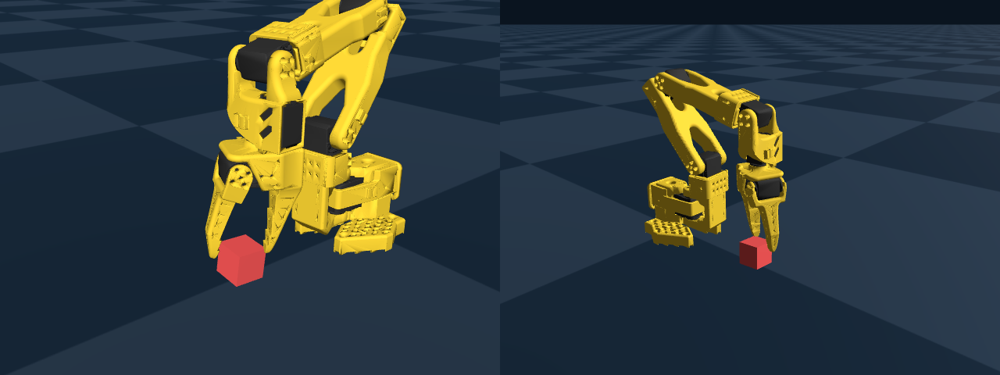
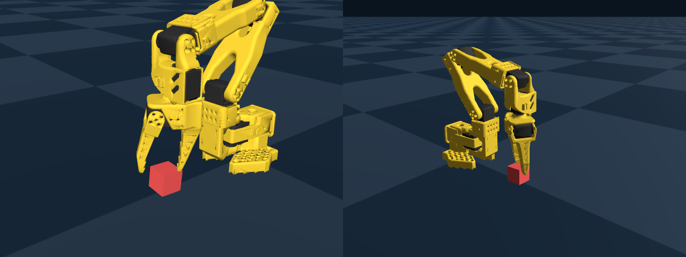
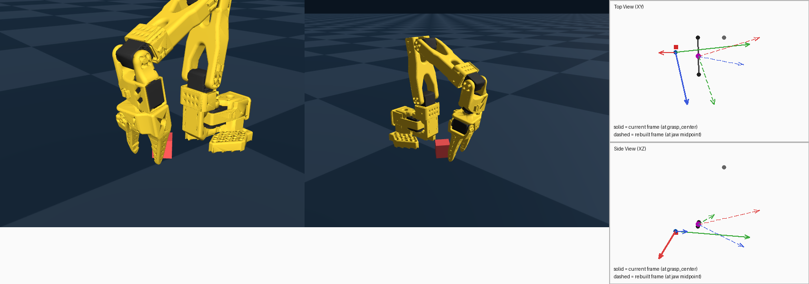
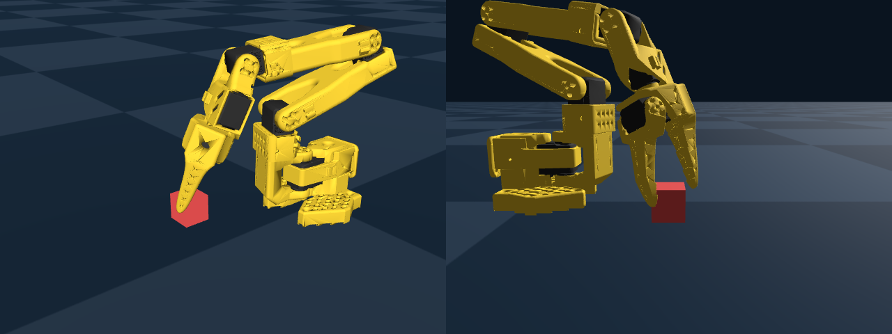
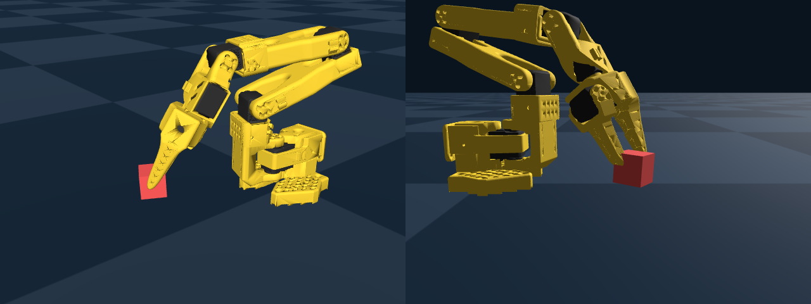

lerobot SO-101 × Genesis 仿真实战 -- week1


## 摘要

用 Genesis 仿真 SO-101 做 cube 抓取，花了一周踩坑。核心教训：5-DOF 机械臂做 top-down grasp 是零冗余问题，官方 MJCF 的 grasp_center 存在系统偏差，必须先标定 TCP、确认可达域，再谈轨迹规划。调 offset 是最不该做的第一步。

## 背景

出发点就是想看看社区有什么非IsaacSim的仿真方案(btw, 我是老黄忠实粉)。然后发现了两个项目:
[Genesis]() 和 [ManiSkill3]() ，其中，Genesis repo start 快30k 了，作为入门感觉很合适了。机器人框架，其实也没经验，听说过 [lerobot]()，看了下repo，确认很多丰富了。作为入门感觉也是妥妥的。

lerobot 里面最基础款的机械臂是 [so-101]()，5/6 DOF 最小充分必要了，就选这款。后来发现，Genesis samples 其实提供的是 Franka 机械臂。后文会提到这里的坑。


## Day 0

在 GPT老师的帮忙下，很快把 lerobot, genesis 的教学samples 实现并在4090上验证通过了。一方面是自身需要快速了解下lerobot, genesis 的工作范围，顺便也验证了下 GPT老师对lerobot, genesis不抓瞎(过程有些genesis 版本问题，导致api 没用对，但是G老师很快就fix了)。整个工作估计不到1hrs，信心大增，感觉最多一周就能把 lerobot + genesis 做仿真数据合成、训练、验证都走通了。

## Day 1 ~ 6

第二天一上来，直接想法就是把 so101 机械臂放到 genesis 仿真环境中，做个抓取实验，大概是最简单的demo了。要导入 so-101 肯定要准备个机械臂模型文件，第一眼找到的是hugginface上so101.mjcf 的模型文件。直接丢给G老师，帮忙基于这个模型文件，在genesis中搭建catch cube 场景。很快脚本完成了，丢给4090 测试，然后就开始问题来了。


### 1. 1st-time 调参 offset 

首先是没抓取成功，基本现象就是爪子只能碰到cube上表面，或压、或蹭、最后是抓空；或者干脆机械臂就是在空中乱舞。跟G老师聊了几轮，大概说法是需要调整 offset-xy。好的，我肤浅地理解了大概就是没对准吧，需要调参。就让G老师再设计扫offset-xy的实验，固定当前cube 的xyz 位置。

G老师吭哧地做实验，我就先补充下genesis流程和机器人概念:

__Genesis SO-101 抓取管线__

```
┌─────────────────────────────────────────────────────────────────┐
│              Genesis SO-101 抓取 管线                             │
│                                                                   │
│  ┌─────────────┐    ┌─────────────┐    ┌─────────────────────┐   │
│  │  场景构建    │    │  轨迹规划    │    │   数据写入           │   │
│  │             │    │             │    │                     │   │
│  │ • SO-101    │───▶│ • IK 求解   │───▶│ • observation.state │   │
│  │   MJCF 加载 │    │ • 状态机    │    │ • action (degrees)  │   │
│  │ • 目标物体  │    │   Home      │    │ • images.top        │   │
│  │   域随机化  │    │   PreGrasp  │    │ • images.wrist      │   │
│  │ • N 个并行  │    │   Approach  │    │ • task (文本)        │   │
│  │   环境      │    │   Grasp     │    │                     │   │
│  │             │    │   Lift      │    │ LeRobotDataset      │   │
│  │             │    │   Place     │    │ .add_frame()        │   │
│  └─────────────┘    └─────────────┘    │ .save_episode()     │   │
│                                        └─────────────────────┘   │
│                                                                   │
│  输出：HuggingFace Dataset（可直接用于 lerobot 训练）               │
└─────────────────────────────────────────────────────────────────┘
```


__so-101 关节示意__


```
                          SO-101  6-DOF 机械臂关节示意图
                              （侧视 · Home 姿态）

          [1] shoulder_lift                    运动类型     角度范围(约)
               ◉─────────────── 大臂 ──┐      ↕ 俯仰      -90° ~ +90°
              ╱                         │
             ╱ [0] shoulder_pan         │
      ↺ 水平旋转                   [2] elbow_flex
            │                           ◉      ↕ 俯仰      -120° ~ +120°
       ┌────┴────┐                      │
       │ ▓▓▓▓▓▓ │                       │
       │  底座   │                  小臂 │
       │ ▓▓▓▓▓▓ │                       │
       └────────┘                  [3] wrist_flex
      ▀▀▀▀▀▀▀▀▀▀▀▀                     ◉      ↕ 俯仰      -90° ~ +90°
      ═══桌面═══                        │
                                   [4] wrist_roll
                                        ◉      ↻ 自旋      -180° ~ +180°
                                        │
                                   [5] gripper
                                      ┌─◉─┐
                                      │   │    ↔ 开合      0° ~ 70°
                                      ╘═══╛
```


__抓爪概念__

```
SO-101 gripper 结构示意（侧视，close 状态）

     ┌──────────────┐
     │  gripper body │  ← "gripper" link = 腕部/夹爪基座
     │  (body origin)│     它的坐标原点在这里，不在指尖
     └──────┬───────┘
            │
    ┌───────┴────────┐
    │                │
    ▼                ▼
 ┌─────┐        ┌─────┐
 │fixed│        │moving│  ← moving_jaw_so101_v1 (活动爪)
 │ jaw │  ████  │ jaw  │
 │     │  ████  │     │     ████ = 被夹住的 cube
 └──┬──┘        └──┬──┘
    │              │
    └──────◉───────┘
           ↑
      jaw pinch center（夹持中心点）
      = 两指尖闭合时的中心接触点
```


__调参概念__


**approach_z**

`approach_z` 是 **抓取参考点** 相对于方块中心的 z 偏移量。这个“抓取参考点(grasp_center)”必须先定义对，才能谈 `approach_z` 是否合适。


```
        approach_z = 0.02（默认）       approach_z = 0.0（更低，接近可抓）

     z(m)                                     z(m)
     0.05 ┤                                   0.05 ┤
          │                                        │
     0.04 ┤                                   0.04 ┤
          │    ┌───┐ ← IK 目标点                    │
     0.035┤    │ ◉ │   (gripper frame)             │
          │    │   │                          0.03 ┤ ┌─────┐ ← 方块顶部
     0.03 ┤ ┌──┤   ├─┐ ← 方块顶部                   │ │     │
          │ │  └───┘ │                             │ │     │
     0.015┤ │ ██████ │ ← 方块中心              0.015┤ │██◉██│ ← IK 目标 = 方块中心
          │ │ ██████ │                             │ │█████│   指尖在两侧包住方块
     0.00 ┤ └────────┘ ── 桌面                 0.00 ┤ └─────┘ ── 桌面
          └──────────────────                      └──────────────────

    问题：指尖在方块顶部上方                    正确：指尖能包住方块两侧
    夹爪"虚握"→ 方块不动                       夹爪产生接触力 → 可以抬起
```


**offset_xy**

IK 求解出的夹爪位置与方块中心之间可能存在系统偏差。`offset` 是施加在 approach/close/lift 阶段的**额外空间微调**

```
            俯视图（从上往下看）
      y
      ↑
      │    每个 · 是一组 (ox, oy) 候选
      │
 +0.01│  ·    ·    ·    ·    ·
      │
+0.005│  ·    ·    ·    ·    ·
      │
  0.0 │  ·    ·    ◆    ·    ·     ◆ = 方块中心（IK 默认目标）
      │                ↑
-0.005│  ·    ·    ·   ★ ·    ·     ★ = 找到的最佳 offset
      │
 -0.01│  ·    ·    ·    ·    ·
      └──────────────────────→ x
        -0.01      0.0     +0.01
```


**offset_z**

```
     oz > 0（太高）          oz = 0（默认）           oz < 0（更低）
        ┌─┐                    ┌─┐                    ┌─┐
        │ │ ← 指尖             │ │                    │ │
        └─┘                    └─┘                    └─┘
                            ┌──────┐               ┌──────┐
      ┌──────┐              │██████│               │██│ │██│
      │██████│              │██████│               │██└─┘██│ ← 指尖在方块侧面
      └──────┘              └──────┘               └──────┘

     完全不接触             偶尔擦到                 有接触，可能抓住
     Δz ≈ 0               Δz ≈ 0.005              Δz ≈ 0.01+
```

差不多把概念捡起来了，G老师的实验也完成了。不过实验结果是 **单独调整offset-xy，approach阶段，cube总是不会落在两爪之间，不能成功抓取**。这期间还发现G老师有个定义上的错误，G老师一上来默认`-20`比 `0` 夹得更紧，实际是 **gripper_close**数值上越大，开口越大。


| 概念 | 英文 | 说明 |
|------|------|------|
| **EE** | End Effector | 末端执行器，对 SO-101 来说就是整个夹爪机构 |
| **TCP** | Tool Center Point | 工具中心点，EE 上的一个参考点，IK 的目标。在本项目中 = `grasp_center` body |
| **gripper** | — | MJCF 中的 link，对应腕部/夹爪基座。注意：它的 body origin 在基座，不在指尖 |
| **fixed jaw** | — | 固定爪（不动的那一侧），是 gripper body 几何的一部分 |
| **moving jaw** | - | 活动爪（由 `gripper` joint 驱动的那一侧） |
| **jaw pinch center** | 夹持中心点 | fixed jaw 和 moving jaw 闭合时，两个指尖之间的中心接触点。**这是物体被夹住的真正位置** |
| **grasp_center** | — | MJCF 中人为添加的固定 body，挂载在 gripper body 下。设计意图是作为 TCP 让 IK 能直接求解到夹持中心点 |
| **gripperframe** | — | 官方 MJCF 中的 site，`grasp_center` body 复制了它的 pos/quat |
| **body origin** | link 坐标原点 | 每个 link body 的坐标原点。注意：body origin ≠ mesh 的视觉最远端（指尖） |


### 2. 1st-time 标定 grasp_center

让G老师逐帧图像分析这些failure case，比较明显的共性是: **jaws(抓爪)能touch 到cube，但是都是jaws的外缘擦边cube一点，cube不在两爪中间**。G老师的结论是，**存在TCP几何对齐问题**，所以上述单纯调整offset-xy 没效果。进一步大概有两个问题：

1. TCP 参考点是否存在系统偏差。
2. IK Solver 自身能否正确求解关节位姿，能完美抵达IK目标点。

__系统偏差标定__

还有个插曲：so101 不同格式的模型文件有很大的diff。大概是so101 demo机械臂的现实问题: 因为在组装机械臂过程，不同装配上存在系统偏差，从而并没有一个通用的模型文件。所以，不能直接把随便一个真机的模型文件直接给仿真环境使用。如下:

| 指标 | URDF | MJCF | 改进 |
|------|-------------|-------------|------|
| 模型来源 | HuggingFace URDF + 13 STL 手动下载 | Genesis-Intelligence/assets 自动下载 | 更简洁 |
| Home 跟踪误差 | 8.27° | **0.12°** | **69× 改善** |
| DOF 数 | 6（需 `fixed=True`） | 6（MJCF 天然固定基座） | 无需额外参数 |
| EE link | `Fixed_Jaw` / `gripper` | `gripper` | 一致 |
| 加载复杂度 | URDF 下载 + STL + `fixed=True` + base_offset | MJCF 单文件 + auto-download | 大幅简化 |
| state range | [-147.6°, 100.0°] | [-154.3°, 121.5°] | IK 覆盖范围更大 |

接下来，首先将so101 模型文件换成了 genesis 提供的 MJCF 格式，然后基于MJCF 模型文件调参 grasp_center。直接让G老师写标定脚本:

1. 读取 XML 里的当前 `grasp_center.pos` / `grasp_center.quat`
2. 固定 cube pose `[0.16, 0.0, 0.015]`，做 deterministic XY offset coarse + refine 搜索
3. 用 `approach_tcp_error`、`approach_z_abs_error`、`approach_xy_error`、`local_xy_center_error` 等指标排序
4. 输出：
   - best runtime offset（world）
   - `suggested_grasp_center_delta_local`
   - `suggested_grasp_center_pos_local`
5. 将上述推荐 grasp_center 写回 xml

| 版本 | `grasp_center.pos` local | 评分函数逻辑 | 主要现象 | 结论 |
|---|---|---|---|---|
| `default` | `[-0.0079, -0.000218, -0.0981]` | 官方默认，无修正 | XY 常落在 cube 边缘，close 时容易擦边空抓 | 可达性好，但 TCP 未对准真实夹持中心 |
| `v1` | `[-0.0297, -0.0039, -0.0957]` | 优先 `lift_delta` / `close_contact_delta` | 明显 over-shot；从一侧偏到了另一侧 | 旧评分把"推着走"误判为好结果 |
| `v2` | `[+0.0004, +0.0069, -0.1023]` | 优先 close 首帧 `local_xy_center_error` | XY 投影更居中，但 IK sanity 退化到 ~7.9mm，lift=0 | 几何评分好但 IK 可达性退化，实际执行更差 |
| `v3` | `[+0.0093, -0.0065, -0.0942]` | 先约束 approach 可达性，再考虑 close 居中 | IK sanity 恢复 0.2mm；lift_delta=+0.004m；close 阶段仍有挤走 | 当前最可用；下一步优先调抓取流程参数 |

这个初步标定实验至少有个明显的结论: **官方模型文件预定义的 grasp-center 是存在系统偏差**，后续实验也要基于这个跟新的 grasp_center 继续。注意，这里的 `grasp_center` 只是 MJCF 预定义的一个 link，名字叫做 `grasp_center`，有固定的pos/quat，相对 gripper body origin(parent link)。

__IKSolver 准度实验__

ik solver 能否将关节送到指定的位置.   基于不同的参考点，实验发现:

| link | world z (body origin) | 与 cube center_z 差 |
|------|---------|-------------------|
| grasp_center(预定义TCP代理点)| 0.015 | 0（IK 精度 0.0002m） |
| gripper (body origin) | 0.104 | +0.089 |
| moving_jaw (body origin) | 0.090 | +0.075 |

从这组实验能确认：**以grasp_center 作为 IK target，IK Solver 求解的姿态是非常精确的**

回到最初的问题，jaws 老是在cube 边缘晃动，现在来讲就是**之前给定的 grasp-center 与真实抓取中心 cube center 不一致**。


### 3. 2nd-time 调参offset

有了上述跟新的标定参数v3，当然值得让G老师把实验重新来一遍。不过，不幸的是，approach阶段，爪子落点的XY还是偏在cube的某一侧，cube 仍然没有进入两爪居中的位置。我先入为主地认为，对grasp_center 的标定已经正确了，现在看到的这点偏差，就是重新调整 offset-xy 吧。

而且基于第一次调参offset的经验，大概能在世界坐标下:

- `oy` 主要控制 jaw corridor 在 cube 上表面平面内的左右平移
- `ox` 主要控制 gripper 相对 cube 的前后接近深度

让G老师分别跑了几组实验:

__固定ox, 扫oy__

- `ox = +0.004`
- `oy in {-0.004, -0.002, 0.000, +0.002, +0.004}`

**ox0004_oyp0004**


**ox0004_oym0004**


基本观察：

- `oy` 从 `+0.004 -> -0.004` 后，left view 中 jaw corridor 明显整体横向移动
- 这说明 `oy` 的主效应是整体平移，而不是只改某一根爪子的相对位置
- 但 right view 中，内侧爪仍会先碰到 box 里侧，因此问题不只在 `oy`


__固定oy，扫ox__

- `oy = +0.004`
- `ox in {+0.004, +0.002, 0.000, -0.002}`

**ox0000_oyp0004**



基本观察：

- `ox` 从 `+0.004 -> 0.000` 后，right view 中内侧爪“往里顶”的程度减弱
- 这说明 `ox` 的主效应更像是前后深浅，而不是左右居中
- 同时，left view 中 box 仍大致留在 jaw corridor 附近，没有立刻被挤出两爪之间


__anchor重测__

从上述两轮实验中提取正向趋势，做新的anchor: 

- `ox = 0.000`
- `oy = -0.004`

基本观察：

- 与 `ox0004_oyp0004` 相比，这组在 `approach -> close` 过程中，box 仍基本留在两爪之间
- 但 `approach` 阶段仍出现较明显翻转，说明当前 baseline 还不能直接进入 `close` 调参
- 因此，当前问题已从“完全进不去 jaw corridor”推进到“能进入 corridor，但 approach 仍不够 quasi-static”

**ox0000_oym0004**




#### 总结与反思

上述二次调offset的几组实验，已经大致能判断 `ox / oy` 对抓爪与 cube 上表面平面相对位置的影响。但显著的问题是：`approach` 阶段 cube 就因为被jaws按住或擦碰而发生较明显翻转，导致 box 上表面不再与水平面（操作台）平行。但这已经有点反直觉了。这么简单的 cube 抓取任务，抓爪应该直接垂直下来就刚好夹住cube，然后lift，即使有轻微接触，但不应出现明显翻转、明显平移或明显穿透。

另外一个更重要的信号: **offset_x/y 只是一个补偿工具，不应该成为 grasp 的主要调参路径**

~~Day 3 结束~~


### 4. 求解参数实验 

进一步做了求解器参数的实验。

1. `episode_length=[8, 12, 16]`， 仍然是同样的现象，cube被抓爪碰倒。说明 **approach step 粒度不是主因**
2. IK quat_down 约束，直接造成 IK 求解失败，基本认识是 **5-DOF 机构无法同时满足 grasp_center 的位置约束和 top-down 朝向约束**


### 5. 2nd-time 标定 grasp_center

基于新标定的grasp-center，上述调整位置(xyz)等基本不解决问题。G老师怀疑: **不是单纯的 pos 偏了一点，而是grasp_center 的 frame 的轴方向本身就不对**。即存在quat 的偏差，单纯调offset-xyz 显然不解决问题。

__轴误差验证__

接下来, G老师设计了一个快速验证实验：以 v3 标定的 grasp-center quat(3轴方向) 与 jaws 基于 jaw cooridor, closing 和 approach 方向为xyz 做几何重建后 grasp-center.quat， 然后在世界坐标比较下，v3 预定义的grap-center.quat 与 jaws 几何重建的 grasp-center.quat 是否一致。分别使用`二次调参offsest` 中两组offset 参数来重建grasp-center.quat ：

* 验证组1 oxyz=[0.008, 0.000, -0.010]
* 验证组2 oxyz=[0.000, -0.004, -0.010]

| 项目 | 当前 v3 `grasp_center` local | 几何重建 quat（v4） | 对比说明 |
|---|---|---|---|
| `pos` | `[0.009342, -0.006544, -0.094165]` | `[0.013867, 0.002400, -0.082094]` | `delta ≈ [+0.004525, +0.008944, +0.012071]` |
| `quat` | `[0.707107, 0.0, 0.707107, 0.0]` | `[0.144190, -0.598573, -0.684636, -0.390119]` | 当前 frame 轴语义与 jaw 几何目标轴系明显不一致 |
| 轴语义误差（deg） | - | `x≈131.64, y≈91.20, z≈74.36` | 两组 offset 条件下结果基本一致（结论稳定） |

展开推导可以证明 `residual_local = jaw_mid_local(gripper_angle) - gc_local_pos`，其中 `gripper_world_rot` 完全约掉。也就是说 **`residual_local_delta` 只取决于 `gripper_angle` 和 `gc_local_pos`，与 arm 构型（肩/肘/腕关节角度）无关**。两组用的是同一份 v3 XML 和同一个 `gripper_open=20`，所以残差完全一致

更直观地，让G老师把上述轴方向差异 画出来:



其中 **实线箭头**（红/绿/蓝）表示 v3 local `grasp_center` frame 的 x/y/z 轴，原点在蓝点处； **虚线箭头**（红/绿/蓝） 是从 jaw corridor 几何重建的 x/y/z 轴，原点在品红点处 

上图有两个重要信息：

1. **位置残差**：蓝点（current grasp_center）和品红点（jaw midpoint）之间的间距 ≈ `residual_world_delta`。在 Top View 里蓝点在品红点左侧偏下，Side View 里蓝点在品红点左下方，说明当前 `grasp_center` 相对于真实夹持中心在 XY 和 Z 上都有偏差。

2. **轴方向不一致**：实线箭头（current frame）和虚线箭头（rebuilt frame）完全不重合。Top View 里最明显的是红色箭头（x 轴）：实线红指向左侧，虚线红指向右上，基本相反（对应 `x ≈ 131.64 deg`）。绿色箭头（y 轴）也近乎正交（对应 `y ≈ 91.20 deg`）。

**关键问题是：当前轴误差在对当前抓取流程(ik 求解)里有实际影响吗**

1. 当前 IK solver 调用都是 `quat=None`（position-only IK），所以 `grasp_center.quat` 不参与 IK 求解，不改变手臂构型
2. pos_delta 可以直接跟新。`suggested_local_pos≈[0.0139, 0.0024, -0.0821]` 替换 v3 标定的grasp-center pos:`[0.0093, -0.0065, -0.0942]`。

至此，完成 v4 重新标定。相比v3 标定，三个分量都是正向修正，总位移量 ≈ 12mm。

__v4 标定验证__

再使用上述两组offset，验证下 v4 标定下的残差：

```
Residual world delta:      [0.0, -0.0, -0.0]
Residual local delta:      [0.0, 0.0, 0.0]
Suggested local pos:       [0.013867, 0.0024, -0.082094]  (= v4 pos，无进一步修正)
```


结论: v4 pos 几何正确（残差=0），IK 可达（`quat=None` 下 sanity err=0.2mm）

~~Day 4 结束~~

### 6. 3rd-time 调参 offset-xy

__v4 调参__

拿到v4 标定参数后，剩下的问题又回到 offset 的微小调整了吧。G老师又不会抱怨，再刷一遍offset-xy 。这次直接上2nd-time 调参好的种子上直接实验，并重点关注下jaws重建几何的轴向偏差

| exp | offset(ox, oy, oz) | closing_axis_offset | approach_axis_offset | centering_error | jaw_balance_error | 结论 |
|---|---|---:|---:|---:|---:|---|
| Exp1 | (0.004, -0.004, -0.01) | +0.0287m | +0.0264m | 0.0413m | 0.0665m | 偏差很大，且有 tilt |
| Exp2 | (0.002, -0.004, -0.01) | +0.0275m | +0.0269m | 0.0410m | 0.0644m | contact/tilt 改善，但几何偏差仍大 |
| Exp3 | (0.000, 0.000, -0.01) | -0.0199m | +0.0143m | 0.0332m | 0.0290m | 方向改变但偏差仍显著 |

几个比较明显的现象: 

* `closing_axis_offset`表示(cube_center - jaw_midpoint)在 closing 轴上的投影。 其在不同 `ox/oy` 之间会正负翻转（例如约 `+0.02m` 到 `-0.02m`），说明 XY offset 只是在左右两侧切换。
* `approach_axis_offset`表示 `(cube_center - jaw_midpoint)` 在 approach 轴上的投影。 其多数仍为正，且常在厘米级，说明沿 approach 方向仍存在系统偏差。
* `centering_error`， `||cube_center_world - jaw_midpoint_world||`，表示 cube 中心与两爪中点的 3D 距离（越小越好）。其与 `jaw_balance_error` 没有被 offset sweep 拉到很小量级（仍是厘米级）。

__tcp_offset w cube__

继续杯具，v4标定后也不解决`抓不到的问题`。G老师又给了个建议: 检查下 **tcp_offset=tcp_actual - ik_target**，看看是否实际 TCP 相对 IK 目标点的存在系统偏差。基于上述3组实验: 

| exp_ref  | offset(ox, oy, oz) | ik_target (x,y,z) | tcp_actual (x,y,z) | tcp_offset (x,y,z) | gripper_jaw_z | cube_top_z | jaw_below_top |
|---|---|---|---|---|---:|---:|---|
| Exp3 |(0.000, 0.000, -0.010) | (0.1600, -0.0000, 0.0167) | (0.1644, -0.0001, 0.0229) | (+0.0044, -0.0001, +0.0062) | 0.0649 | 0.0289 | False |
| Exp2 | (0.000, -0.004, -0.010) | (0.1600, -0.0040, 0.0167) | (0.1644, -0.0043, 0.0229) | (+0.0044, -0.0003, +0.0061) | 0.0650 | 0.0291 | False |
| Exp1 | (0.004, 0.000, -0.010) | (0.1640, -0.0000, 0.0167) | (0.1688, -0.0002, 0.0235) | (+0.0048, -0.0002, +0.0068) | 0.0641 | 0.0296 | False |

可以看到，上述3组实验，确实都存在一致的 `tcp_offset~=[0.004, -0.0002, 0.006]`，但是这时候并不能说就是存在系统偏差，更可能是抓爪碰到了cube，产生了个偏差。

__tcp_offset wo contact__

G老师继续做了个无碰撞(no cube)的实验，来观察 tcp_offset 系统偏差。


继续实验前，首先约定grasp-center exactly 就必须是 `inner pinch surface midpoint(接触面中点)`，不是 link-origin。因为在 Genesis 里，link.get_pos() 返回的是 link frame origin 的世界坐标，不是接触点/夹爪尖端点，参考[rigid_link.py]()，实现上： 从 XML 读 fixed_jaw_box / moving_jaw_box，计算各自的 inner surface world point，再算 jaw_midpoint。

- 采用`link origin`参考，“约 6cm 偏差”，但不代表真实夹持接触中心。
- 采用 `fixed_jaw_box/moving_jaw_box` 内侧接触面中点后，`grasp_center` 与 jaw midpoint 在 `approach` 基本重合。


然后，固定exp1 参数，去掉cube，统计 tcp_offset 以及 delta_jaw :

```yml
tcp_offset_global_mean = [ +0.00050, -0.00001, +0.00049 ] m
tcp_offset_global_std_over_points = [ 0.00126, 0.00003, 0.00118 ] m
delta_jaw_global_mean = -0.02241 m
delta_jaw_global_std_over_points = 0.00259 m
```

几个结论:

1. 无接触下，大多数点 `tcp_offset` 接近 0（亚毫米到毫米级），以 jaws-midpoint 作为 grasp-center。
2. 无接触下 `delta_jaw` 并不为 0（均值约 `-22mm`），说明“jaw 相对高度差”在无接触时也存在，不能仅用接触来解释；其来源可能是 `quat=None` 姿态自由度 + link origin 定义
3. 与有 cube 结果对照，先前大偏差更像接触扰动 + 局部 IK/姿态残差放大，而非存在系统tcp_offset 偏差

到这份儿上，已经有些难受了。很naive toy-level的 实验，为什么就是不能成功呢。


### 7. delta_z 调平

第6组实验中发现当前构型和位姿下，即使没有cube抓取，两爪之间默认就会有个高度差(delta_jaw)，**这很奇怪**。两爪(jaws)都呈现了一定的roll 转角。从而导致approach 过程总有一个爪子先碰到cube 上表面。那么应该先对 jaws 做 delta_z 调平，尽量让下来抓取cube 的爪子高度上先平衡下。

实验目标：将 `delta_z = z_moving - z_fixed` 收敛到阈值内（`|delta_z| <= 0.004m`），再进入稳定抓取。

G老师完成了实验，而且确实能看到 `约束 delta-z` 前后的变化:

before:


after:


单独看 `delta-z约束`是有效的，**但是**，引入delta-z约束后，IK Solver 再基于init-plan 的waypoints 继续求解会发散，完全不能回到 approach-hold这条轨迹上。即在 approach 过程是把两爪扳平了，整个轨迹却又坏了，最终到不了cube。

### 8. IK可达性问题

实验目标：以“当前 pose + delta-z恢复姿态”为起点，做**纯重新规划 replan**。

```py
  // ... after leveling succeeded
  for ri in range(N_REPLAN_WPS):          # 4 步
      alpha = (ri + 1) / N_REPLAN_WPS     # 0.25, 0.50, 0.75, 1.00
      desired_mid = mid_leveled + alpha * (pre_close_target - mid_leveled)
      rp_wp = solve_ik_seeded(
          desired_mid,                     # 期望 midpoint 世界坐标
          args.gripper_open,
          replan_prev_rad,                 # 上一步的关节角做种子
          quat_target=quat_ref,            # ← 固定姿态约束!
          local_point=mid_local_pt,
      )
      replan_wps.append(rp_wp)
      replan_prev_rad = np.deg2rad(np.array(rp_wp, dtype=np.float32))
``` 

这里 IK solver 同时需要满足两个约束：
  * 位置：把 midpoint 送到 desired_mid
  * 姿态：让 grasp_center link 的朝向等于 quat_ref（调平后锁定的姿态）

SO-101 只有 5 个有效自由度（夹爪开合是6-th DOF）。5 个 DOF 要同时满足 3 个位置约束 + 3 个姿态约束 = 6 个约束，自由度不够。IK solver 在 damping=0.02 的阻尼最小二乘下做折中，只能牺牲位置去保姿态。于是 midpoint 卡住，无法向cube 前进。出现了典型的 **full pose constrained 在数学上是 over-constrained**。


__rot_mask 弱约束__

通过引入 `rot_mask` ，解决了上述 over-constrained 的问题，IK 可以继续下探: 

```py
    rp_wp = solve_ik_seeded(
        desired_mid,
        args.gripper_open,
        replan_prev_rad,
        quat_target=quat_ref,
        local_point=mid_local_pt,
        rot_mask=[False, False, True],
    )
``` 

这时候:

* desired_mid = [0.160, 0.000, 0.017]（cube center 正上方）
* mid_actual = [0.157, 0.004, 0.035]
* X 方向差 ~3mm（很小），但 Z 方向差 18mm（0.035 vs 0.017）。也就是说 mid 的 XY 已经基本对准了，但高度还偏高 1.8cm**

**IK 在 rot_mask=[F,F,T] 约束下只能把 midpoint 送到 Z=0.035，还差 ~1.8cm 到不了目标高度。仍然是可达性问题**

一个直觉的想法，就是把 cube-height 太高。当然看起来很丑。cube-height=0.08后，虽然从 IK 约束求解角度可达了，但是先发生了抓爪和cube的碰撞，倒地后，还是没法抓取。

直觉上，**使用 delta_z 平衡+replan ，对于一个简单的抓取实验已经非常复杂了。somewhere must be wrong**

~~Day 5 结束~~


### 9. 可行性空间实验

__5-DOF 运动学的硬约束__

SO-101 有 5 个有效自由度（shoulder_pan, shoulder_lift, elbow_flex, wrist_flex, wrist_roll），第 6 个是夹爪开合。在一个 top-down pinch grasp 任务中需要同时满足:

| 约束 | DOF 需求 | 说明 |
|------|---------|------|
| XYZ 位置 | 3 | 把 jaw midpoint 送到 cube center |
| approach 方向 (pitch) | 1 | 夹爪朝下 |
| jaw plane 对齐 (yaw) | 1 | 两爪平面与 cube 侧面平行 |
| 总计 | 5 | 刚好用完所有 DOF |


这意味着**零自由度冗余** -- IK 只有唯一解。

前面实验的每一次调参（offset_xy, approach_z, quat_mode, roll_tuning, rot_mask, cube_height）都是在一个零冗余系统里做扰动。没有冗余意味着：

  * 改 offset → IK 解跳到完全不同的构型
  * 改 cube 高度 → 可达区域边界完全变化
  * 加姿态约束 → 直接变成 over-constrained

**这不是"没搜到好参数"，而是搜索空间的结构本身不支持稳定解**

这个认识直接改变了问题的解法：与其继续盲调 offset，不如先把 SO-101 的 **可行抓取域（feasible grasp region）** 算出来。让G老师写了个可行域扫描脚本，核心逻辑：遍历 `(cube_x, cube_y, approach_z, gripper_open)` 的离散网格，对每组参数做 position-only IK 求解，过滤条件为 `pos_err < 1mm`、`|delta_z| < 4mm`、`jaw_gap > cube_size`，输出所有满足条件的 feasible 参数组合。

结果发现：**之前一直使用的 cube 位置 `[0.16, 0.0, 0.015]` 恰好处于可行域的边界甚至外侧**。这就解释了为什么前面所有调参都像在刀尖上跳舞——初始条件本身就不在稳定可行域内。可行域脚本推荐了一组新的默认参数：

```yml
cube_x=0.15, cube_y=-0.06, cube_size=0.03
grasp_offset_z=0 
approach_z=0.012 
gripper_open=25
→ pre_close_target_z = 0.015 + 0 + 0.012 = 0.027 (最优 z 层)
```

该点 pos_err=0.27mm, delta_z=-1.46mm, jaw_gap=33.7mm > 30mm — **fully feasible**。关键变化是 `cube_y` 从 `0.0` 移到了 `-0.06`，使 cube 更靠近机械臂的 shoulder_pan 旋转轴自然下摆方向，IK 求解的构型更自然，jaws 的 roll 倾斜也大幅减小。

再回头看，最开始G老师给的初值 `cube_y=0.0` 恰好把 cube 放在了可行域边缘——这才是前面所有实验失败的根本原因。直接拿新参数跑一把:





竟然抓到了，虽然最终穿过了，大概是 gripper 角度问题，以及碰撞相关参数的设置问题。接下来让G老师刷几组实验。

1. substeps 从 4-> 8 no difference
2. use_jck 碰撞算法, no difference
3. jaw-box thickness (0.002 -> 0.004), no difference 
4. 调整gripper_close角度

| close | cube_shift_z (m) | cube_shift_norm (m) | cube_tilt_deg | 结果 |
|---:|---:|---:|---:|---|
| 16 | 0.09516 | 0.09623 | 13.81 | 可稳定 lift |
| 18 | 0.09431 | 0.09555 | 10.73 | 可稳定 lift |
| 20 | 0.09389 | 0.09504 | 9.49 | 可稳定 lift |


~~Day 6 结束~~

## 总结

在G老师（GPT）大力支持下，经过一周的反反复复，终于在 Genesis 仿真环境成功抓起来了 cube。回顾整个过程，踩过的坑本质上可以归结为一句话：**在一个零冗余的 5-DOF 系统里，问题的正确打开方式是先确认可行域，而不是调参数。**

核心教训：

1. **先算可行域，再谈抓取**。5-DOF 机械臂做 top-down grasp 是零冗余问题，cube 的摆放位置必须在 IK 可行域内。不在可行域内的初始条件，任何 offset / approach_z / 姿态约束调参都不会收敛。
2. **标定 TCP（grasp_center）是前置条件**。官方 MJCF 的 `grasp_center` 与真实 jaw midpoint 存在约 12mm 的系统偏差，不标定就做抓取实验等于在错误坐标上做所有后续计算。
3. **offset 是补偿工具，不是主调参路径**。如果需要大幅度调 offset 才能抓到，几乎一定是上游（TCP 标定或 cube 位置）出了问题。
4. **≤6 DOF 机械臂加姿态约束要非常谨慎**。5 个 DOF 满足 3 位置 + 3 姿态 = over-constrained，IK solver 会牺牲位置精度做折中。`rot_mask` 部分松弛是必要手段。

**可行域扫描 → TCP 标定 → position-only IK → 验证抓取 → 再微调**

这个顺序能省掉大概 80% 的无效实验。

**后续将持续更新：随机化合成数据以及 VLA 后训练**
