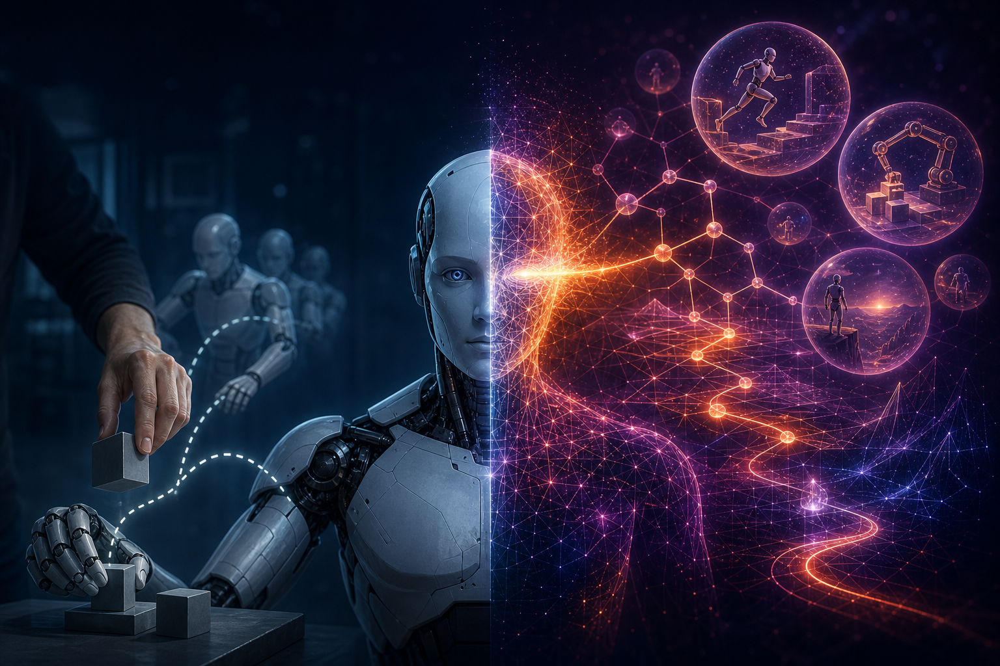

# 从模仿到想象：VLA 如何用强化学习(RL)与世界模型(World Model)捅破天花板

> [English](readme-en.md) | 中文



过去两年，VLA（视觉-语言-动作模型）靠模仿学习一路狂奔，却始终撞在同一道天花板上：**学得再像，也超不过示范数据**。2026 年，整个领域的目光聚到了同一个问题——怎么让机器人**用奖励自我改进**，又怎么让它绕开"真机试错太贵"这道坎，干脆**在一个学出来的"世界模型"里低成本地试错**。

这篇文章就顺着这条线，从上往下把它讲透：为什么 VLA 需要 RL（§1）→ 动作头的选择如何决定整条 RL 路线（§2）→ flow 头做 RL 的核心障碍与解法（§3）→ 用三根正交轴把满地的工作一次归位（§4）；再转到"经验从哪来"（§5），引出 world model 当低成本 rollout 引擎的一整条 world-model-RFT 谱系（§6）、以及它那条 reward-free 的平行路线 WAM（§7）；最后收束到一个被低估、却值得做的方向（§8）——**与其治世界模型的"幻觉"，不如直接用真物理造一个天生不会幻觉的世界模型**。

---

## §1 范式：为什么 VLA 需要 RL

VLA（Vision-Language-Action）的主流训练方式是模仿学习——在专家演示的 `(观测, 动作)` 对上做行为克隆。这条路的根本局限，是**天花板等于数据质量**：策略学的是"专家这一步选了什么动作"，它能逼近专家，却无法发现比专家更好的策略；遇到示范没覆盖的长尾状态、错误恢复场景，模仿学习也无从下手。

强化学习恰好补的就是这块。它不问"专家会怎么做"，而问"什么动作能拿到更高回报"，因此能**超越示范**、能在闭环里学会纠错。所谓 VLA + RL，本质就是把 VLA 从"模仿专家"升级成"用奖励自我改进"。

但这一步并不免费。RL 引入了信用分配（credit assignment）、探索（exploration）、奖励设计（reward design）三个老难题，而在具身场景里还多一条最贵的约束：**真机交互贵、慢、危险、样本效率（sample efficiency）低**。这条约束会贯穿全文——它既是后面 world model 登场的理由，也是本篇切入点的由来。

---

## §2 分叉点：动作头之争如何决定 RL 路线

要给 VLA 做 RL，第一件事不是挑算法，而是看它的**动作头**怎么吐动作——因为这直接决定 RL 能不能做、怎么做。

今天的动作头有三种范式：

| 范式 | 代表 | 怎么产生动作 | 天然有可算 log π? |
|---|---|---|---|
| **离散 token 自回归** | OpenVLA、π0-FAST | 动作分箱成 token，像 LLM 一样逐 token 生成 | **有**（softmax 天然） |
| **Diffusion 头** | Octo、Diffusion Policy | 从高斯迭代去噪成连续动作块（16–32 步） | 无（确定性，需改造） |
| **Flow-matching 头** | **π0 / π0.5 / GR00T** | 学直线传输噪声→动作（4–8 步，比 diffusion 快数倍） | 无（确定性 ODE，需改造） |

没有单一赢家，但趋势清楚：高频、灵巧、接触密集的操作里，生成式头（flow / diffusion）占优——π0 用 flow 做到 50Hz，而自回归离散头有硬性时间分辨率天花板；flow 相对 diffusion 又赢在延迟（直线路径步数更少），所以当前前沿是 flow-matching。

关键在最后一列。**动作头有没有天然可算的 log π，直接决定 RL 的第一道坎**：

- **离散自回归**：softmax 天然有 log π，RL 直接套，PPO / GRPO 皆可（代表：SimpleVLA-RL）。
- **flow / diffusion**：动作由**确定性 ODE** 一步步积分出来，**算不出 log π**——而策略梯度必须要 log π（要算重要性比）。所以这条路的 RL，第一步不是优化，而是**先把可算的 log π "造"出来**。

这就是整条 flow-RL 技术栈的起点。

---

## §3 核心障碍与解法：给确定性 flow 造一个 log π

确定性 ODE 没有 log π，解法只有一个思路：**给它注入随机性，让每一步去噪变成一个可算概率的高斯转移**。业界有两条实现：

- **Flow-Noise**：挂一个可学的噪声网络（Sigma Net），均值仍是原始 flow 的一步 Euler，方差由噪声网络输出——每步去噪就成了一个各向同性高斯，log π 可以精确算出来。简单、精确，探索强度可学。
- **Flow-SDE**：把概率流 ODE 数学上等价改写成一条 SDE（加 score 补偿漂移 + 噪声 schedule），同样把每步变成高斯转移。更"正统"，但引入近似。

两条都把"一条确定性轨迹"变成"一串高斯采样"，于是 K 步去噪的联合 log π = 各步高斯 log-prob 的求和（或平均），重要性比、策略梯度就都能算了。

这里还藏着一个具身 flow-RL 特有的结构——**两层 MDP**：

```
外层（环境）:   o_t --a_t--> o_{t+1} --a_{t+1}--> ...     每步给真任务奖励
                  ↑
内层（去噪）:   噪声 → ... K 步高斯转移 ... → 动作 a_t      内层步奖励=0，τ=1 交接给外层
```

外层是真正的环境交互（每步有任务奖励），内层是"生成一个动作"的 K 步去噪过程（中间步奖励为 0，走完在 τ=1 把动作交给外层）。RL 优化的其实是这个嵌套结构。理清它，才能理解 Flow-GRPO、π-RL、VLA-RFT 说的到底是同一件事的哪一层。

---

## §4 三根正交轴：把所有工作归位

理解了 log π 的造法后，会发现这个领域的工作虽多，其实都落在三根**互相正交**的轴上：

```
轴A 动作头：              离散自回归 ── diffusion ── flow-matching     (决定要不要造 log π)
轴B 优化器：              PPO(带 critic + GAE) ── GRPO(组相对优势，去 critic)
轴C 环境转移(env transition)： 真机 ── 仿真 ── world model 想象           (谁来提供 o_{t+1}=f(o_t,a_t))
```

一份工作就是在三根轴上各取一点：

| 工作 | 动作头 | 优化器 | 环境转移 | 一句话 |
|---|---|---|---|---|
| **Flow-GRPO** | flow（图像生成） | GRPO | —（图像生成，非具身） | 给确定性 flow 造 log π + GRPO 的开山，非具身 |
| **π-RL** | flow（π0/π0.5） | **PPO** | 仿真 | Flow-Noise / Flow-SDE 两条实现；长 horizon 实测 PPO > GRPO |
| **SimpleVLA-RL** | **离散自回归** | GRPO | 仿真 | 天然有 log π，跳过造 log π，直接组内比 |
| **VLA-RFT** | flow（Flow-Noise） | GRPO | **world model** | 把经验源从仿真换成学到的 world model |

两点值得记住。其一，**动作头和优化器是正交的**：Flow-Noise 既能配 PPO（π-RL）也能配 GRPO（VLA-RFT），别把"flow"和某个优化器绑死。其二，PPO 与 GRPO 的取舍在于 critic——PPO 带 critic + GAE，长 horizon、细粒度信用分配更强（π-RL 在具身长 horizon 上实测 PPO 胜）；GRPO 用一组样本的相对好坏当 baseline、免 critic，适合单步/短 horizon。

真正让这个领域在 2026 分化出一整片新工作的，是**轴 C（环境转移，env transition）**。

---

## §5 环境转移从哪来：real / sim / world model

RL 要与环境交互取经验，而具身 RL 最贵的就是这个环境。轴 C 的三个选项，本质是在回答"**谁来提供环境转移 `o_{t+1}=f(o_t,a_t)`**"（注意：这三者差的是转移/动力学；奖励往往另配，尤其 world model 还要外挂 reward）：

```
真机       → 经验最真、grounding 完美 → 但贵、慢、危险、样本效率低
仿真       → 便宜可并行、有真值奖励   → 但有资产/场景搭建成本 + sim-to-real gap
world model → 用"学到的环境"当想象引擎 → 便宜、可并行，但会幻觉、有 grounding gap
```

第三条是 2026 的爆点。所谓 **world model 当 rollout 引擎**，就是把上一节两层 MDP 里的"环境层"从真机/仿真，替换成一个**学出来的、action-conditioned 的世界模型**——给它当前观测和一个动作，它预测下一帧。这样策略就能在"想象"里大量试错，精准打击真机交互贵的瓶颈。

但要认清它的定位：**world model 不取代 RL**，它只改变"经验从哪来"，信用分配、探索、奖励设计这些 RL 难题一个都没少——所以这类工作内部**仍在跑 RL**。它换来省样本，代价是引入了一笔新税：**imagination 与现实的 grounding gap**（模型偏差会沿 rollout 复合放大），需要少量真机交互 + 表征对齐来校正。

也正因为这笔"幻觉税"，接下来一整条谱系，几乎都在跟它较劲。

---

## §6 world-model-RFT 谱系：五代演化与两个死穴

这条线的开山是 **VLA-RFT**（2510.00406）：策略用 Flow-Noise、优化器用 GRPO、经验来自一个学到的自回归 world model。它最精巧的地方在**奖励怎么定**——不是任务成功的 oracle，而是"策略 rollout 与专家 rollout 的视觉相似度"。

这里有个容易困惑的点：world model 生成的帧哪来的真值去比？答案很绕但很关键：**参考侧也是 world model 生成的**。把真实的专家动作**再喂进同一个 world model 跑一遍**，得到 WM(专家)，再和 WM(策略) 比。为什么这么绕？因为 world model 不完美、生成帧自带 artifact；如果拿 WM(策略) 去比真实帧，就把"动作差"和"生成质量差"混在了一起。而 WM(策略) vs WM(专家) 用的是同一个模型，**生成偏差在两侧同时出现、相减抵消，只剩下动作差异**——像用同一台有色差的相机各拍一张再比，色差自然抵消。

但这也暴露了 VLA-RFT 的天花板：它 verify 的是"**像不像专家**"，不是"**对不对**"，本质是 imitation-in-outcome-space，**天花板仍是专家质量**。加上它的 world model 只是个 138M 的 task-specific 小模型，这就是它自己 Limitation 里点名的两个死穴：**① WM 太弱；② reward 靠专家相似度、不可 scale**。

2026 的后续几乎全在打这两点，形成一条快速迭代的谱系（是概念代际、非严格时间序）：

| 代 | 主题 | 代表作 | 攻击的问题 |
|---|---|---|---|
| **第 1 代** | 证明可行 | **VLA-RFT** (2510.00406) | 首个完整"学到的 WM 当仿真器 + RL 微调 flow VLA"pipeline |
| **第 2 代** | 治 hallucination | **WoVR** (2602.13977) | rollout 越长越离谱不是 reward 的病，是 WM 本身的病 |
| **第 3 代** | task-agnostic WM | **RAW-Dream** (2605.12334) | 为什么每个任务都要重训一个 WM？解耦 physics 与 task + VLM 当 reward |
| **第 4 代** | 物理一致性 | **RehearseVLA** (CVPR 2026) | video WM "视觉好、physics 差"→ 要物理可信 + 会判终止 |
| **第 5 代** | runtime verification | **Pre-VLA** (2605.22446) | 不再一味提升 WM，而在喂 WM/执行前先验证、拦掉坏 rollout |

贯穿这五代的主线，是一次重心转移：**从"让 world model 更准"，转向"world model 不完美时如何仍做稳定有效的 RL"**。WoVR 限制幻觉对优化的影响，RAW-Dream 把 physics 与 task 解耦、并用现成 VLM 零样本判成败当 reward（顺手解决"reward 不可 scale"），RehearseVLA 引入物理一致性和终止判断，Pre-VLA 干脆在入口处拦坏样本——都是同一思路的不同切面。

---

## §7 另一条路：WAM——reward-free 地抬高天花板

前面整条谱系都在做 RL（用 reward 捅破天花板）。但同一个"世界模型"，还长出了一条完全不做 RL 的平行路线：**World-Action Model（WAM）**。

区别的要害，是 **action 的流向**：

```
Action-Conditional WM（轴C 的仿真器）:  (o, a) ──► o'      action 是【输入】，它是"环境"
World-Action Model（WAM）:              o ──► ô_future ──► a   action 是【输出】，它是"会想象的智能体"
```

前者（ACWM）就是 §5 里当 RL 环境用的那种——action 是输入，它预测后果，自己不决策，必须外挂一个策略。后者（WAM）把"预测未来"接回动作路径：先预测未来（像素/latent/特征），再据此吐动作。它用行为克隆训练（动作损失是 BC，世界模型损失是自监督预测），因此**reward-free**——它不捅破天花板，而是靠更聪明的架构 + 更广的数据（能吃 action-free 的人类视频）把**模仿学习的天花板抬得更高**。

有意思的是，ACWM 和 WAM 常常是**同一枚硬币的两面**：很多统一模型（UWM、Motus、DreamZero）靠"哪个模态当条件、哪个当生成目标"就能切换身份——给 `(o,a)` 出 `o'` 就是 ACWM，给 `o` 出 `a` 就是 WAM。这正是"world model as substrate"的含义。

WAM 这条线 2026 的主旋律是 **Dream Less, Act More**：Fast-WAM（2603.16666）给出一个近乎暴击的结论——**未来预测的价值在训练期的表征学习，不在推理期的想象**，于是它保留视频co-train、推理时干脆跳过未来pixel生成，inference efficiency 快 4×；LaWAM（2606.15768）把未来搬到 latent 空间一次出子目标，inference efficiency 快 24×。这条线正收敛到"训练期用视频学表征、推理期尽量不生成"，是当前**最可部署**的一支。

所以核心：**WAM（轴 2）抬高模仿天花板，RL（轴 1）捅破它，两者正交可叠。**

---

## §8 一个值得做的方向：用真物理当"不会幻觉的世界模型"

把前面串起来看，2026 这一整片工作——WoVR、RAW-Dream、RehearseVLA、Pre-VLA——几乎都在跟同一个敌人搏斗：**学出来的 world model 会瞎编物理**（幻觉、imagination drift、物理不一致）。它们花大力气去治幻觉、硬造物理一致性、运行时拦坏 rollout。

顺着这个观察，有一个被忽略的杠杆值得一提：**如果"世界模型"本身就是真物理呢？** 一个 GPU 物理仿真器（如 Genesis）加上 3D Gaussian Splatting 的真实感渲染，本质就是一个**完美的 action-conditional world model**——真物理的 `(o,a)→o'`，只不过它不是学出来的、**根本不会幻觉、物理天然一致**。别人花一篇 CVPR 去近似的东西，它天然免费；别人拼命治的幻觉，它压根不存在。

这条路在工程上也顺：WoVR 所在的 **RLinf** 框架已经把 harness 搭好了——支持 π0/π0.5/OpenVLA-OFT + GRPO/PPO + 一堆真仿真器，而且**环境后端可替换**。WoVR 就是"环境后端 = 学习式 Wan world model"的现成实现；把环境后端换成真物理仿真 + 真实感渲染，就得到一个"真物理环境后端"的对照臂。同框架、同策略、同算法，只换环境层——这是教科书级的干净对比。

而且这个方向不必绑死在 RL 上。同一套"真物理 + 真实感渲染"基建，在不同目标下能扮演不同角色：

| | **研究路（RL）** | **落地路（WAM / 微调现成 VLA）** |
|---|---|---|
| 目标 | 有区分度的贡献 | 最短路径到能用的系统 |
| 是否训基模 | 否 | 否 |
| 是否做 RL | 是（核心） | 否（后期可选） |
| pipeline | 重（RL 闭环 + reward + WM） | 轻（线性 IL 微调） |
| 见效 | 慢、不确定 | 快、可交付 |
| 真物理基建的角色 | 免幻觉的 RL 环境 | 数据引擎 + 自动化评测底座 |

一个更一般的判断是：**在这波浪潮里，护城河或许不在模型，而在环境/数据层**。谁手里有一条真物理、免幻觉的环境/数据生产线，谁就能同时供给 RL（当干净环境）和 IL/WAM（当数据与评测底座）。与其挤进"治学习式 world model 幻觉"的红海，不如从源头绕开幻觉——这是本文想留下的一个方向性判断。

---

## 写在最后

回头看这条线，其实一句话就能串起来：VLA + RL 的主轴，始终是"用奖励超越示范"——模仿学习让机器人学得**像**，强化学习才让它学得**更好**。

而 2026 真正的热闹，都发生在"经验从哪来"这一环。真机太贵、仿真有 gap，于是大家把目光投向 world model：让机器人在一个学出来的世界里"做梦式"地试错。可梦做久了会失真——幻觉、漂移、物理不一致，成了这条路的新税。于是我们看到一整片工作，从"把世界模型做得更准"，悄悄转向了"世界模型不完美时，怎么还能稳稳地做 RL"。

也正是在这个转向处，本文想留下一个也许被低估的判断：与其花力气去治世界模型的幻觉，不如换个思路——直接用真物理仿真加真实感渲染，造一个**天生就不会幻觉**的世界模型。它既能当研究里干净的 RL 环境，也能当落地时可靠的数据与评测底座。

从"看专家怎么做"，到"自己试错"，再到"在想象里试错"——机器人正在学会的，或许不只是动作，而是想象力本身。

---

## References

综述 / 框架：

- World Action Models: A Survey — [arXiv:2606.20781](https://arxiv.org/abs/2606.20781)（NUS，按"生成多少未来"分 rendered / latent / video-free 三家族）
- RLinf — [github.com/RLinf/RLinf](https://github.com/RLinf/RLinf)（支持 π0/π0.5/OpenVLA-OFT + GRPO/PPO + 多仿真器，环境后端可替换）

flow-RL 主线：

- Flow-GRPO — 给确定性 flow 造 log π + GRPO（图像生成）
- π-RL — [arXiv:2510.25889](https://arxiv.org/abs/2510.25889)（Flow-Noise vs Flow-SDE；PPO）
- ReinFlow — [arXiv:2505.22094](https://arxiv.org/abs/2505.22094)（Flow-Noise 之源）
- SimpleVLA-RL — 离散动作头 × GRPO（平行对照）

world-model-RFT 谱系：

- VLA-RFT — [arXiv:2510.00406](https://arxiv.org/abs/2510.00406)（第 1 代，Flow-Noise × GRPO × world model）
- WoVR — [arXiv:2602.13977](https://arxiv.org/abs/2602.13977)（治幻觉，KIR + masked GRPO + PACE；随 RLinf 开源）
- RAW-Dream — [arXiv:2605.12334](https://arxiv.org/abs/2605.12334)（task-agnostic WM + VLM reward）
- RehearseVLA — CVPR 2026（物理一致 simulator + instant reflector）
- Pre-VLA — [arXiv:2605.22446](https://arxiv.org/abs/2605.22446)（runtime verification）

WAM（reward-free 平行线）：

- Fast-WAM — [arXiv:2603.16666](https://arxiv.org/abs/2603.16666)（未来预测的价值在训练期表征，推理跳过生成）
- LaWAM — [arXiv:2606.15768](https://arxiv.org/abs/2606.15768)（latent 子目标，24× 加速）
- UWM — [weirdlabuw.github.io/uwm](https://weirdlabuw.github.io/uwm/) · DreamZero · Motus（CVPR 2026）（可切换 ACWM/WAM/IDM 的统一模型）
