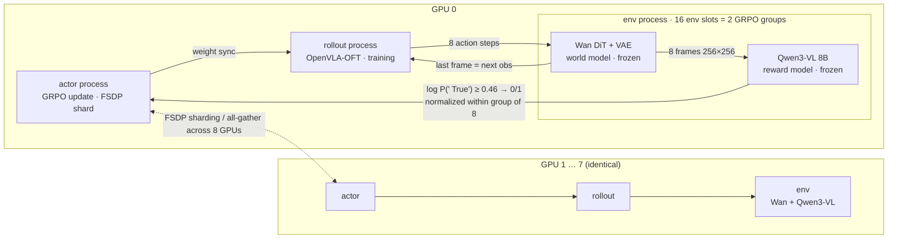

# WorldLoop: Training-Free VLM as Rewards for Online RL of VLA inside World Model

Post-training VLA policies with RL inside a learned world model is by now a well-established direction: the policy explores in imagined frames instead of paying for real-robot interaction. But one piece of that loop still depends on a simulator — **the reward**. A world model emits pixels, not scores, so task success has to come from a separate reward model, and the public reward-model checkpoints are trained on labels lifted straight out of privileged simulator state (in LIBERO, predicates such as `is_obj_placed`). A pipeline that claims to have left the simulator behind is still having the simulator produce its reward.

This post removes that last dependency. The reward model becomes a **training-free** Qwen3-VL, read the way [TOPReward](https://arxiv.org/abs/2602.19313) does it: take the log-probability of the `" True"` token as the success signal, and never generate any text. On LIBERO-spatial, over the full 500-trial enumeration in the real simulator, success goes from 0.448 to 0.560 — indistinguishable from a ResNet reward model fine-tuned specifically on that suite. Point the same weights and the same frozen threshold at LIBERO-object, changing one line of instruction text, and it still holds up. Everything runs on 8× AMD MI300-series GPUs (ROCm 6.4) using only public artifacts: [RLinf](https://github.com/RLinf/RLinf) main, the Wan world-model weights and OpenVLA-OFT checkpoints on Hugging Face, and `Qwen3-VL-8B-Instruct`.


---

## Dropping the simulator costs you two things

Classical robot RL gets its environment from a physics engine — IsaacSim and friends. The case for a world model is not that it is cheaper or faster than a simulator; **it is that a world model exists where a simulator does not**. A simulator's coverage is capped by how much someone modeled: assets, contact physics, lighting and scenes all have to be built by hand, and nobody is going to hand-build the long tail of real deployment environments. A world model is data-driven, so its coverage grows with embodied data — and deployment happens in the real world, not on a benchmark.

But take the simulator away and you lose two things: the **dynamics** (given an action, what does the next frame look like) and the **oracle** (is the task done). World models supply the first. The second is usually filled back in by training a success classifier on the target domain — **and that classifier's labels can only come from privileged simulator state**. The second hole was never closed; it was just moved offline.

The endpoint of this line of work is a setting with no simulator at all, where there is neither a physics engine nor an `is_obj_placed` to query. **Both holes have to close together — a WM-as-env stack that only closes the dynamics half is unfinished**, which is why the reward model has to be training-free as well.

LIBERO serves as a calibration ground here, not as a demonstration of value. Where simulation is cheap and physically correct, a world model buys you nothing; its job at this stage is to quantify how much utility you give up by swapping the simulator out, before pushing into settings that have no simulator. Two further choices follow from what a world model is: it has no physical state, and the same visual observation can correspond to different underlying configurations, so a critic rests on softer ground than it would in simulation — hence critic-free GRPO. And every generation carries some dynamics bias, so the loop consumes freshly generated samples only and never replays.

### Three properties of the bundled ResNet reward model

The public Wan LIBERO weights ship with a ResNet-18 reward model that takes only the current frame. It works, and it scores well — it is the control arm in everything below. But three of its properties keep it from reaching the end of this road, and **the first one is fatal**.

**Its labels come from privileged simulator state.** Changing task suite means changing weights: the LIBERO-spatial and LIBERO-object reward models are two different files, and neither can be produced without a simulator.

The other two are shape problems. First, the output is success/failure rather than progress, with a distribution extreme enough that 83% of 16,384 frames score below 0.01; the pipeline then rounds before use, so GRPO's within-group comparison frequently degenerates into all-success or all-failure with zero advantage — **71% of samples carry no gradient in practice**. Second, the input is image-only, with no instruction, so the model cannot tell which task the current environment is supposed to be performing. That last point defines the shape of any replacement: **the reward model must take the instruction as input, or changing suite can never be as cheap as changing one line of text.**

---

## TopReward

Using a VLM as a reward model is not new. The usual approach asks it to emit a verdict or a completion percentage in text, which has consistently underperformed on open-source VLMs — leading to a fairly common conclusion that open-source VLMs simply are not good reward models.

**The problem is the readout, not the model.** TOPReward never lets the VLM generate text at all; it reads the log-probability of the `" True"` token directly. On the *same* open-source model, the text-output approach yields near-zero correlation while reading token logits yields a Value-Order Correlation of 0.947. **The signal was in the model the whole time, bottlenecked by the text interface.**

Three things were checked offline on frame dumps before wiring any of this into training, at zero GPU cost: semantics remain legible on diffusion-generated frames (instruction discrimination 4/4, comparable to 5/7 on real frames); success and failure separate within the same initial state; and scoring once per chunk costs 3.4% of the rollout stage. **The first check is the one that could have killed the whole idea** — TOPReward's 0.947 was measured on real recorded video, whereas the frames here carry artifacts, blur, and physically implausible detail, and nobody had measured that gap before. There was no degradation.

The genuinely sensitive knob turns out to be **the scoring window, not the threshold**. Given only the current chunk (8 frames), four failed trajectories outscored every successful one and the ordering inverted completely; two chunks (16 frames) restored separation. Every experiment below therefore fixes the window at 16 frames.

---

## The loop

One chunk — 8 action steps — is the atomic unit: **OpenVLA-OFT produces actions, Wan turns actions into frames, Qwen3-VL turns frames into 0/1.** Only OpenVLA-OFT's weights change; the other two stay frozen throughout. All three worker types are collocated, with actor, rollout, and env running as three separate Ray processes on every GPU, and all eight GPUs identical.



**What holds the design together is the shape of the output.** The reward model emits 0/1 rather than a continuous score, matching what the ResNet produced after its `round()`, so the difference-and-sum, the termination test, and the `loss_mask` truncation all carry over unchanged and GRPO needed no edits at all. Swapping the reward model is a clean substitution that leaves the algorithm alone.

That same shape is why it lives inside the env worker process. In a real simulator both the reward and the termination criterion derive from one physical predicate; a world model has neither, so this single 0/1 serves as both the immediate reward and `terminations`. And `terminations` is a field of the environment's step return — it must have a value at return time, whereas a bolt-on reward worker can only fold its score in after the step has already advanced.

None of these components is novel on its own. [RAW-Dream](https://arxiv.org/abs/2605.12334) uses the same Wan-family action-conditioned world model, OpenVLA-OFT, GRPO, and a frozen Qwen3-VL; its contribution is replacing the world model with a general one pre-trained on task-free data, whereas the Wan used here is still the per-suite fine-tuned public checkpoint. **The arm reported here therefore corresponds to the baseline row in their table, not to their method.**

---

## Results

Evaluation always runs against the real MuJoCo simulator: 10 tasks × 50 trials, a full 500-trial enumeration, reading `success_once` (the target predicate was satisfied at some point — LIBERO's official definition). The world model is never invoked during evaluation. Run-to-run noise on this measurement is about 3 points.

### LIBERO-Spatial: on par with the suite-specific model

The two arms are identical except for the reward model.

| Reward model | Steps | n=500 | vs. start |
|---|---|---|---|
| — | start (spatial SFT) | 0.448 | — |
| ResNet (suite-specific weights) | 20 | 0.574 | +12.6 |
| **Qwen3-VL (training-free)** | **10** | **0.560** | **+11.2** |
| Qwen3-VL (training-free) | 20 | 0.532 | +8.4 |

**The training-free reward model is indistinguishable from the one trained for this suite**, and the ResNet is now entirely out of the loop at no cost in wall-clock or memory. The two arms peak at different steps: Qwen tops out at step 10 and falls back to 0.532 by step 20, which is again within noise of its own peak, so there is no evidence of an actual downward trend. There is still headroom along the step axis — the ResNet arm reaches 0.618 by step 80, so this recipe has not saturated on spatial. Whether a world model can stand in for the simulator during training was measured in [the previous post](https://andyluo7.github.io/rocm/amd/mi300x/vllm-omni/worldmodels/dreamzero/robotics/vla/2026/08/14/world-models-vllm-omni-rocm-dreamzero/): at 20 steps, the world-model arm scored 0.574 against 0.572 for real MuJoCo.


The black squares are the real-simulator n=500 readings and are the only basis for any claim here; the blue line is the world model's internal success rate, useful only for spotting a collapsed run.

### LIBERO-Object: changing suite costs one line of text

τ and the 16-frame window were calibrated on spatial frames, which means the training-free claim had not actually been tested on spatial at all — **testing it requires the same constants to work as-is on a different suite**. Recalibrating on object would produce nicer numbers, but the thing being delivered would become "one threshold calibration per suite," which is only an order of magnitude cheaper than "one trained checkpoint per suite."

| Reward model | What changed for the new suite | base | step 10 | step 20 |
|---|---|---|---|---|
| ResNet (object-specific weights) | a different `.pth` | 0.342 | 0.368 | 0.348 |
| **Qwen3-VL (training-free)** | one line of `task_suite_name` | 0.342 | 0.352 | **0.378** |

**Both frozen constants transferred as-is.** The threshold degenerated neither into never-firing nor into always-firing; the Qwen arm improved measurably over its base and stayed level with the ResNet arm. Cross-suite reuse cost exactly one line of instruction text.

**Both arms gained very little in absolute terms, though** — the Qwen arm's +3.6 points barely clears the measurement noise, and the ResNet arm managed only +0.6. What object establishes is that the reward model transfers without loss, not that this recipe is effective on object; the latter would first require explaining why object's world model or SFT starting point cannot support a larger gain, which is a separate question.

Putting the two training curves side by side also surfaces a contrast that spatial could not produce.


**A reward model that is being optimized against overestimates itself; a frozen one underestimates.** The ResNet arm's in-world-model reading settles around 0.55 against a real score of 0.348 — roughly 20 points optimistic. The Qwen arm reads about 0.18 against a real 0.378 — roughly 20 points pessimistic. The ResNet's weights come from this suite's privileged state labels and the policy is actively doing GRPO against it, which pushes its internal reading up; the frozen Qwen3-VL has never seen this data and judges more strictly than ground truth. The remaining panels move in opposite directions too: the ResNet arm's gradient norm decays from 10 to 5 and its loss from 0.72 to 0.64, the shape of convergence, while the Qwen arm holds a gradient norm of 7–8 with loss rising from 0.33 to 0.53 and trigger coverage from 0.37 to 0.56 — the reward model fires more and more often but is never satisfied, so the gradient never decays.

This bias is not specific to the setup here. Training-time monitoring for WM-as-env generally leans on that in-world-model success curve, and whenever the reward model is also the thing being optimized against, the curve is systematically optimistic; a frozen reward model gives you a conservative reading instead. **That is a second argument for training-free rewards, independent of cross-domain reuse.** Both spatial curves only show overestimation, which leaves the cause ambiguous between a general property of reward models and an artifact of optimization — the object pair is what separates the two.

---

## Reproduce

Single node, 8× AMD MI300, 1 TB host RAM, all Python inside the container.

```bash
# Weights: OpenVLA-OFT spatial SFT ~15 GB, Wan world model 14 GB, Qwen3-VL-8B separate
bash 01_setup_spatial_sft.sh
SUITES="spatial object" bash _stage_node.sh

# Baseline score; every gain below is relative to it. ~28 min, expect 0.448
LOGDIR=$ROOT/results/eval-base bash 03_eval_sim.sh

# Dependency layer for the reward model: the image ships transformers 4.40.1,
# which does not know Qwen3-VL, while OpenVLA-OFT fails to load under 4.57.1.
# 4.57.1 goes into a separate directory and the env worker overrides its own
# sys.modules at runtime.
bash _setup_f2_venv.sh
SCRIPT=_probe_topreward_model.py bash 05_probe_qwen.sh   # expect PRECHECK=OK

# Training: PLACEMENT=all spreads all three worker types across the 8 GPUs.
# Steady-state step time 1241 s; 20 steps ≈ 6.9 h.
PLACEMENT=all ENVS=128 RE=2 GBS=2048 LR=1.0e-5 MAX_STEPS=20 SAVE_EVERY=10 \
  CFG=wan_libero_spatial_topreward_grpo_openvlaoft \
  QWEN_PATH=$ROOT/ckpt/qwen3-vl-8b-instruct VLM_LIB_DIR=$ROOT/venvs/f2-vlm-libs \
  TAU=0.46 VLM_WINDOW=16 \
  LOGDIR=$ROOT/results/wm-f3 bash 04_train_wan.sh
```

`ENVS=128` and `group_size=8` fix every other dimension: 8 env workers with 16 env slots each, which puts **all 8 trajectories of a GRPO group inside the same process**; 8192 samples and 4 optimizer updates per step, across 32 distinct initial states. The world model and the reward model each exist in 8 replicas, with measured VRAM at 84–116 GB out of 192. The reward model has exactly two knobs, `TAU` and `VLM_WINDOW`; moving to object only requires swapping `CFG` and the suite name.

---

## What comes next

This is the first post in the WorldLoop series, and the recipe it describes is a simple one: use a world model as the training ground in place of an explicit simulator, and a training-free VLM in place of a reward function tuned for a specific task, then optimize the policy against it — validated here on LIBERO-Spatial and LIBERO-Object.

Compute limits meant we neither pushed the step count further nor validated the general reward model across more suites. We nevertheless expect world models to matter as the training ground for continual policy improvement in the messy, varied settings where real robots actually operate. The Wan checkpoint used here is still fine-tuned per evaluation suite; subsequent work will move to an embodiment-native world model and a broader range of tasks.

---

## References

- [TOPReward: Token Probabilities as Hidden Zero-Shot Rewards for Robotics](https://arxiv.org/abs/2602.19313)
- [WoVR: World Models as Reliable Simulators for Post-Training VLA Policies with RL](https://arxiv.org/abs/2602.13977)
- [RAW-Dream: Reinforcing VLAs in Task-Agnostic World Models](https://arxiv.org/abs/2605.12334)
- [World-VLA-Loop: Closed-Loop Learning of Video World Model and VLA Policy](https://arxiv.org/pdf/2602.06508)
- [RLinf](https://github.com/RLinf/RLinf)
- [RLinf-Wan-LIBERO-Spatial](https://huggingface.co/RLinf/RLinf-Wan-LIBERO-Spatial)
- [OpenVLA-OFT](https://github.com/moojink/openvla-oft)
- [Qwen3-VL](https://github.com/QwenLM/Qwen3-VL)
- [Wan2.2](https://github.com/Wan-Video/Wan2.2)
- [LIBERO](https://github.com/Lifelong-Robot-Learning/LIBERO)
- [Serving World Models on AMD GPUs: DreamZero and Robot Policies with vLLM-Omni on ROCm](https://andyluo7.github.io/rocm/amd/mi300x/vllm-omni/worldmodels/dreamzero/robotics/vla/2026/08/14/world-models-vllm-omni-rocm-dreamzero/)
