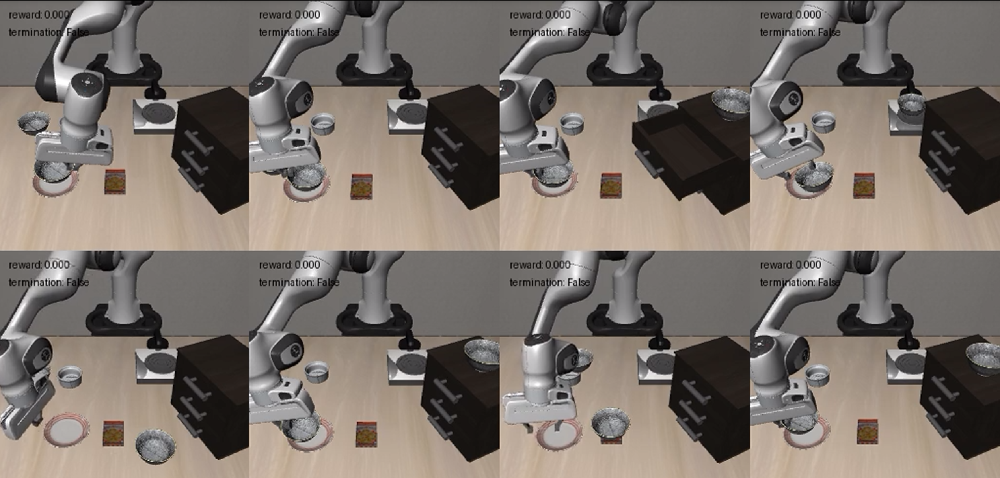
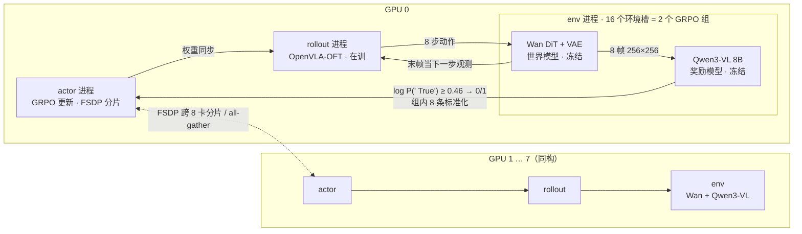
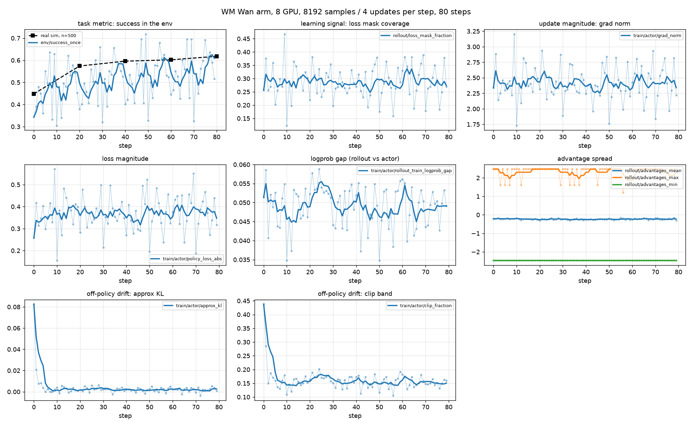
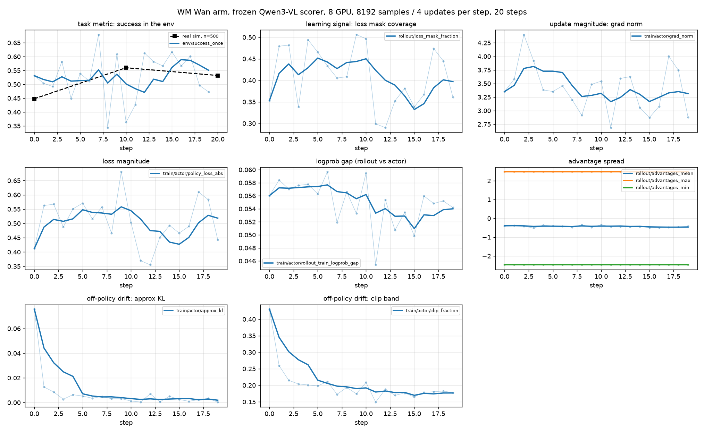
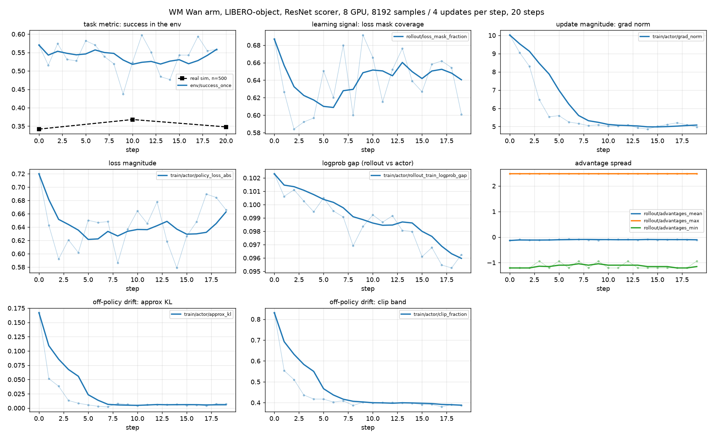
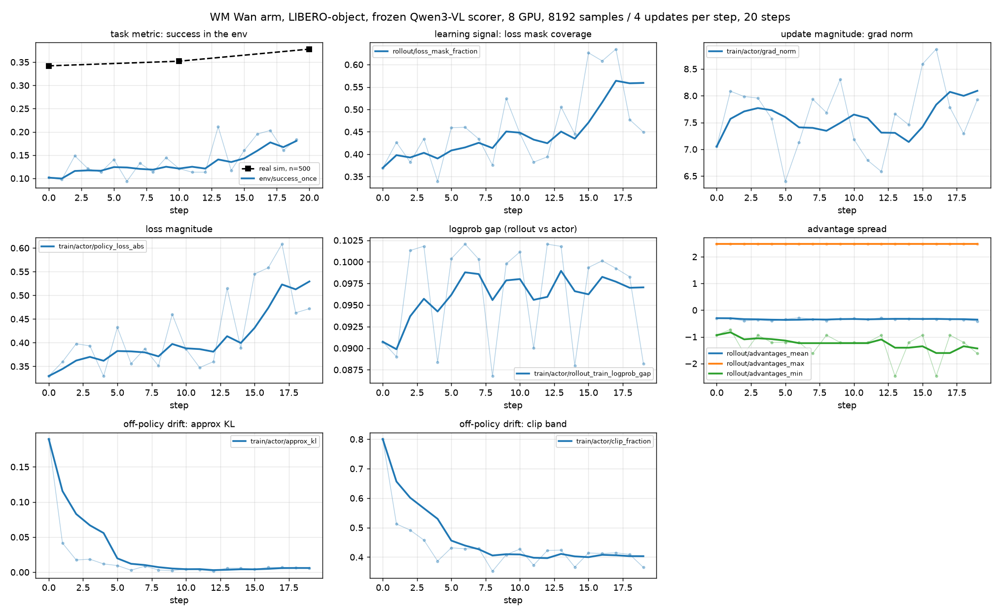

# WorldLoop: 零训练的 VLM 当奖励模型，在世界模型里做 VLA 在线强化学习

用具身世界模型给策略模型（VLA）做强化学习后训练，已经是一条明确的路线——策略在想象出来的画面里试错，不需要昂贵的真机交互。但现有方案里还有一处依赖仿真器：**奖励**。世界模型只出画面、不出分数，所以要外挂一个奖励模型；而公开的那些奖励模型权重，训练标签恰恰取自仿真器的特权状态（LIBERO 里是 `is_obj_placed` 这类谓词）。于是号称摆脱仿真器的训练管线，奖励仍然由仿真器生产。

这篇文章把这一处也换掉：奖励模型改成一个**完全不训练**的 Qwen3-VL，按 [TOPReward](https://arxiv.org/abs/2602.19313) 的读法取 `" True"` 这个 token 的 log 概率当成败信号。在 LIBERO-spatial 上真机 500 条全枚举，从起点 0.448 涨到 0.560，与专门在该套件上微调过的 ResNet 奖励模型不可区分；同一份权重、同一个冻结的阈值指向 LIBERO-object，只改一行指令文本，仍然不掉点。全部训练在 8 张 AMD MI300 系列 GPU（ROCm 6.4）上完成，用的都是公开件：[RLinf](https://github.com/RLinf/RLinf) 主线、Hugging Face 上的 Wan 世界模型权重与 OpenVLA-OFT 检查点、`Qwen3-VL-8B-Instruct`。



---

## 拿掉仿真器，丢的是两样东西

传统的机器人强化学习由仿真引擎提供环境（IsaacSim 这类）。**世界模型的价值不在于比仿真器便宜或快，而在于仿真器不存在的地方它存在**——传统仿真的覆盖被建模能力封顶，资产、接触物理、光照、场景都要人搭一遍，不可能快速覆盖各种真实环境；世界模型是数据驱动的，随着具身数据的积累边界跟着长，而真实部署环境本来就不是 benchmark 测试场。

但把仿真器拿掉，丢的不是一样东西，是两样：**动力学**（给定动作，下一帧长什么样）和 **oracle**（任务完成了吗）。世界模型补的是第一样。第二样在多数工作里是靠「在目标域上训一个成败分类器」填回去的——**而那个分类器的标签只能从仿真器的特权状态来**。所以第二个洞并没有被补上，只是被挪到了离线阶段。

这条路线的终点是没有仿真器的场景，那里既没有物理引擎，也没有 `is_obj_placed` 可查。**两个洞必须一起补，只补动力学的 WM-as-env 是个半成品**——奖励模型因此也必须是零训练的。

LIBERO 在这里是标定场，不是价值证明场：在仿真便宜且物理正确的地方，世界模型换不来收益，它的作用是先量出「换成世界模型损失多少效用」，再往没有仿真器的场景推。另外两个由世界模型的性质决定的选择：它没有物理状态、同一视觉观测可能对应不同真实构型，critic 的地基比仿真下软，所以用免 critic 的 GRPO；它每次生成都带动力学偏差，所以只用新生成的样本，不 replay。

### 自带的 ResNet 奖励模型有三条性质

公开的 Wan LIBERO 权重自带一个 ResNet-18 奖励模型，输入只有当前帧图像。它可用，分数也不低，下文的对照实验用的就是它。但三条性质决定了它走不到这条路线的终点，其中**第一条是致命的**。

**标签来自仿真器的特权状态。** 换一个任务套件就要换一份权重——LIBERO-spatial 与 LIBERO-object 的奖励模型是两个不同的文件，而每一份都得有仿真器才造得出来。

另外两条是形状问题。其一，输出是成败而不是进度，概率分布极端到 16384 帧里 83% 小于 0.01，管线使用前还要四舍五入一次，于是 GRPO 的组内比较大量退化成全成或全败、优势恒为零，**实测 71% 的样本不携带梯度**。其二，输入只有图像、没有指令，它无法区分当前环境要执行的是哪个任务——这一条反过来定义了替代方案的形状：**奖励模型必须把指令当输入，换套件才可能只换一行文本。**

---

## 让 VLM 给出成败：读概率，不读文本

用 VLM 当奖励模型不新鲜，通常的做法是让它输出一句成败判断或者一个进度百分比。这条路在开源 VLM 上一直不理想，也因此有一种流行的判断：开源 VLM 不适合当奖励模型。

**但问题不在模型，在读法。** TOPReward 的做法是不让 VLM 生成任何文本，直接读它 `" True"` 这个 token 的 log 概率——同一个开源模型上，文本输出的做法拿到近零的相关性，读 token logits 拿到 0.947 的 Value-Order Correlation。**信息一直在模型里，卡在文本输出这个瓶颈上。**

接进训练管线之前，先在离线的帧 dump 上验了三件事，零 GPU 机时：扩散模型画出来的帧上语义仍可读出（指令判别力 4/4，与真实帧的 5/7 同量级）；同一初始状态下成功与失败分得开；每个 chunk 打一次分只占 rollout 段的 3.4%。**第一件是能一次否掉整条路的**——TOPReward 报的 0.947 是在真机录制的视频上量的，而这里喂进去的帧有伪影、有模糊、有物理上说不通的细节，这个差别此前无人测过。实测没有掉点。

真正敏感的旋钮是**打分窗口而不是阈值**：只喂当前一个 chunk（8 帧）时，四条失败轨迹的得分压过全部成功轨迹，排序完全反转；喂两个 chunk（16 帧）即恢复分离。全部实验因此固定在 16 帧窗口上。

---

## 整体流程

一个 chunk（8 步动作）是这条环的最小单位：**OpenVLA-OFT 出动作，Wan 把动作变成画面，Qwen3-VL 把画面变成 0/1**，只有 OpenVLA-OFT 的权重在更新，另两个全程冻结。三类 worker 全部 collocated，每张卡上同时跑 actor、rollout、env 三个独立的 Ray 进程，八张卡同构。



**撑住整个设计的是输出的形状。** 奖励模型给的是 0/1 而不是连续分，与 ResNet 那次 `round()` 同形，于是差分求和、终止判定、`loss_mask` 的截断全部沿用，GRPO 那一侧一行没改——换奖励模型因此是一次纯粹的替换，不牵动算法。

它住在 env worker 进程内也是这个形状带来的：真仿真器里 reward 与终止判据都从物理谓词那一个判定派生，世界模型两者都没有来源，所以这个 0/1 既当即时回报又当 `terminations`；而 `terminations` 是环境 step 返回值的一个字段，返回时就得有值，外挂的 reward worker 只能在 step 之后把分混进来。

这组组件本身不新：[RAW-Dream](https://arxiv.org/abs/2605.12334) 用的就是 Wan 系的动作条件世界模型加 OpenVLA-OFT、GRPO 和一个冻结的 Qwen3-VL，它的贡献在于把世界模型也换成 task-free 数据上预训练的通用版本，而这里的 Wan 仍是按套件微调的公开权重——**所以本文这条臂对应的是它表里的 baseline，不是它的方法**。

---

## 评测结果

评测始终走真 MuJoCo，10 个任务 × 50 次试验共 500 条全枚举，读 `success_once`（目标谓词曾被满足即算成功，LIBERO 的官方口径），世界模型在训练期完全不调用仿真器。这把尺子的抖动约 3 个点。

### LIBERO-Spatial：与专用权重打平

两条臂除奖励模型外逐项相同。

| 奖励模型 | 训练步 | n=500 | 相对起点 |
|---|---|---|---|
| — | 起点（spatial 监督微调） | 0.448 | — |
| ResNet（该套件专用权重） | 20 | 0.574 | +12.6 |
| **Qwen3-VL（零训练）** | **10** | **0.560** | **+11.2** |
| Qwen3-VL（零训练） | 20 | 0.532 | +8.4 |

**零训练的奖励模型与专门训过的那个不可区分**，且 ResNet 已完全离开这条链，墙钟与内存的代价都是零。两条臂的峰值不在同一步：Qwen 在 step 10 到顶，step 20 回落到 0.532，与峰值同样不可区分，下行趋势因此不成立。步数轴仍有余量——ResNet 臂继续训到 80 步拿到 0.618，这套配方在 spatial 上没有触顶。世界模型能否替代训练期的仿真器则已在[前一篇](https://andyluo7.github.io/rocm/amd/mi300x/vllm-omni/worldmodels/dreamzero/robotics/vla/2026/08/14/world-models-vllm-omni-rocm-dreamzero/)量过：同样 20 步，世界模型臂 0.574 对真 MuJoCo 臂 0.572。




图中黑色方块是真机 n=500 的读数，判据只落在它上面；蓝线是世界模型内部的成功率，仅用于判断训练是否崩溃。

### LIBERO-Object：换套件只改一行文本

τ 与 16 帧窗口是在 spatial 的帧上标定的，因此零训练这一主张在 spatial 上尚未被真正检验——**检验它的条件是同一组常量在另一个套件上原样可用**。在 object 上重标一次能让读数更好看，但交付的方案随之变成「每个套件标一次阈值」，与「每个套件训一份权重」只差一个数量级的成本。

| 奖励模型 | 换套件改了什么 | base | step 10 | step 20 |
|---|---|---|---|---|
| ResNet（object 专用权重） | 换一份 `.pth` | 0.342 | 0.368 | 0.348 |
| **Qwen3-VL（零训练）** | 一行 `task_suite_name` | 0.342 | 0.352 | **0.378** |

**两个冻结常量在 object 上原样可用**：阈值既未退化为从不触发，也未退化为永远触发；Qwen 臂相对 base 有可分辨的上行，且与 ResNet 臂打平。跨套件复用只付出了一行指令文本的代价。

**但两条臂的绝对增益都很小**——Qwen 臂的 +3.6 个点刚超出评测抖动，ResNet 臂只有 +0.6 个点。所以 object 上能下的结论是奖励模型跨套件不掉点，而不是这套配方在 object 上有效；后者需要先解释 object 的世界模型或 SFT 起点为何撑不起增益，是另一个问题。

两条臂的训练期曲线并排放，还读出了一个 spatial 上取不到的对照。




**被优化的奖励模型高估自己，被冻结的低估。** ResNet 臂的世界模型内读数末段约 0.55，真机只有 0.348，高估约 20 个点；Qwen 臂内部读数约 0.18，真机却是 0.378，低估约 20 个点。ResNet 的权重取自该套件的特权状态标签，策略又正对着它做 GRPO，内部读数因此被推高；冻结的 Qwen3-VL 未见过这批数据，判定比真实成功更严格。其余面板同样呈相反趋势：ResNet 臂梯度范数从 10 衰减到 5、loss 从 0.72 降到 0.64，是收敛形态；Qwen 臂梯度范数持平在 7–8、loss 从 0.33 升到 0.53、触发覆盖率从 0.37 升到 0.56，即奖励模型随训练触发得越来越频繁但始终未被满足，梯度因而不衰减。

这个偏置的影响不限于本文的设置：WM-as-env 的训练期监控普遍依赖「世界模型内的成功率」这条曲线，而只要奖励模型同时是被优化的对象，这条曲线就系统性偏乐观，冻结的奖励模型给出的则是保守读数——**这构成 training-free 在跨域复用之外的第二个理由**。spatial 的两条曲线都只呈现高估，无法分辨成因是奖励模型的通性还是优化所致，object 这一对才把两者分开。

---

## 复现

整个训练使用AMD MI300 单节点 8 卡机器。1 TB 宿主内存，所有 Python 在容器里。

```bash
# 权重：OpenVLA-OFT spatial SFT 约 15 GB，Wan 世界模型 14 GB，Qwen3-VL-8B 另算
bash 01_setup_spatial_sft.sh
SUITES="spatial object" bash _stage_node.sh

# 起点分，后面所有增益都相对它。约 28 分钟，预期 0.448
LOGDIR=$ROOT/results/eval-base bash 03_eval_sim.sh

# 奖励模型的依赖层：镜像自带 transformers 4.40.1 不认 Qwen3-VL，
# 而 OpenVLA-OFT 在 4.57.1 下加载不起来，所以 4.57.1 装到独立目录，
# 由 env worker 进程在运行时覆盖自己的 sys.modules
bash _setup_f2_venv.sh
SCRIPT=_probe_topreward_model.py bash 05_probe_qwen.sh   # 期望 PRECHECK=OK

# 训练：PLACEMENT=all 把三类 worker 铺满 8 张卡，稳态步时 1241 秒，20 步约 6.9 小时
PLACEMENT=all ENVS=128 RE=2 GBS=2048 LR=1.0e-5 MAX_STEPS=20 SAVE_EVERY=10 \
  CFG=wan_libero_spatial_topreward_grpo_openvlaoft \
  QWEN_PATH=$ROOT/ckpt/qwen3-vl-8b-instruct VLM_LIB_DIR=$ROOT/venvs/f2-vlm-libs \
  TAU=0.46 VLM_WINDOW=16 \
  LOGDIR=$ROOT/results/wm-f3 bash 04_train_wan.sh
```

`ENVS=128` 与 `group_size=8` 决定了全部规模：8 个 env worker、每个 16 个环境槽，于是**一个 GRPO 组的 8 条轨迹落在同一个进程里**；每步 8192 个样本、4 次优化器更新、32 个初始状态。世界模型与奖励模型各有 8 份副本，显存实测 84–116 GB / 192。奖励模型只有 `TAU` 和 `VLM_WINDOW` 两个旋钮，换到 object 只需把 `CFG` 与套件名换掉。

---

## 总结及后续

这篇工作是 worldloop 系列的第一篇，主要介绍这样一个receipe: 世界模型作为训练场，取代显式仿真器；使用training-free的VLM模型取代面向具体任务优化的奖励函数，实现在特定评估集Libero-Spatial, Object 上策略模型优化。限于训练资源，我们没有继续增加训练steps以及在更多评估集上验证通用奖励模型的收益。不过，我们相信在复杂多样的真实场景下，world model 作为策略模型持续进化的训练场具有重要地位。同时，当前这份 Wan 仍是按具体验证集微调的，我们后续将使用具身原生的世界模型，在更广泛的任务场景下做进一步研究。

---

## References

- [TOPReward: Token Probabilities as Hidden Zero-Shot Rewards for Robotics](https://arxiv.org/abs/2602.19313)
- [WoVR: World Models as Reliable Simulators for Post-Training VLA Policies with RL](https://arxiv.org/abs/2602.13977)
- [RAW-Dream: Reinforcing VLAs in Task-Agnostic World Models](https://arxiv.org/abs/2605.12334)
- [World-VLA-Loop: Closed-Loop Learning of Video World Model and VLA Policy](https://arxiv.org/pdf/2602.06508)
- [RLinf](https://github.com/RLinf/RLinf)
- [RLinf-Wan-LIBERO-Spatial](https://huggingface.co/RLinf/RLinf-Wan-LIBERO-Spatial)
- [OpenVLA-OFT](https://github.com/moojink/openvla-oft)
- [Qwen3-VL](https://github.com/QwenLM/Qwen3-VL)
- [Wan2.2](https://github.com/Wan-Video/Wan2.2)
- [LIBERO](https://github.com/Lifelong-Robot-Learning/LIBERO)
- [用视频世界模型替掉仿真器，训出来的机械臂策略能打几分](https://andyluo7.github.io/rocm/amd/mi300x/vllm-omni/worldmodels/dreamzero/robotics/vla/2026/08/14/world-models-vllm-omni-rocm-dreamzero/)
